```{r setup, include=FALSE}
options(htmltools.dir.version = FALSE)
knitr::opts_chunk$set(echo = FALSE, fig.align = "center")
library(knitr);library(DT);library(shiny)
```


layout: true

<div class="my-footer"><span><a href="https://www.zarathu.com">Zarathu Co.,Ltd</a>   
&emsp;&emsp;&emsp;&emsp;&emsp;&emsp;&emsp;&emsp;&emsp;&emsp;&emsp;&emsp;&emsp;
&emsp;&emsp;&emsp;&emsp;&emsp;&emsp;&emsp;&emsp;&emsp;&emsp;&emsp;&emsp;&emsp;
<a href="https://github.com/jinseob2kim">김진섭</a></span></div> 


---

# Executive summary

.large[
- 연구지원법인 차라투 운영하면서 CDM 공동연구 진행 

- CDM은 병원들의 데이터를 똑같은 형태로 만든다.

- 하나의 분석코드로 다기관메타분석 가능

- 분석 전과정에 R을 이용하나, [Feedernet](https://feedernet.com/) 에서 R없이 기본분석 가능. 
]


---
class: center, middle


# 하는일 


---
# 맞춤형 통계웹


---
# [공개 통계웹](https://openstat.ai) 


---
# 주요 계약 


- 대한심혈관중재학회 [COBIS III 레지스트리](https://clinicaltrials.gov/ct2/show/NCT03068494) 분석: [추가계약](http://pf.kakao.com/_XsuxgC/48388190)


- 서울성모병원 [COREA-AMI II 레지스트리](https://clinicaltrials.gov/ct2/show/NCT02806102) 분석: [10개 연구 계약](http://pf.kakao.com/_XsuxgC/48043955)


- 삼성서울병원 [공통데이터모델(CDM)](http://www.feedernet.org/html/?pmode=cdmdrn) 분석: [심평원 코로나데이터](https://hira-covid19.net/) 분석 중 


- 강동성심병원 CDM 분석지원: 공단표본데이터 분석 중 


- 경기도감염병관리지원단 코로나 대시보드 with Shinykorea: [최종보고](https://shinykorea.github.io/corona-activityrecord) 


- 삼성서울병원 이식외과 육종(sarcoma) 데이터 분석: [5개 연구 계약](http://pf.kakao.com/_XsuxgC/51701089) 


- 해운대백병원 정신질환 네트워크분석: [논문 5편](http://pf.kakao.com/_XsuxgC/52664370) 게재


- 성균관의대 환경역학연구실 [미세먼지 대시보드](http://pf.kakao.com/_XsuxgC/43627405)


- [삼성서울병원 정신과 통계자문계약](http://pf.kakao.com/_XsuxgC/55192190)

- [서울대병원 순환기내과 통계자문계약](http://pf.kakao.com/_XsuxgC/55577702)

---
# 주요 논문 성과 

.large[
SCI 논문 200건 지원
]
<center>
</a>
</center>


---
# 정부지원사업 선정

<center>
</a>
</center>


---
# 22년 IITP 연구개발과제 선정 

.large[
2년 10.5억 with 앤틀러, 파이디지털헬스케어
]
<center>
</a>
</center>


---
# 채용

.large[
(1) R 데이터분석가 
- 병원데이터, 공단/심평원/국건영 데이터

- 분석웹 개발


(2) R 패키지 개발자
- IITP 선정후  채용 

]


]


---
class: center, middle

# 핵심기술 R 

---
# 프로그램 개발, 블로그 운영

.large[
[R](https://www.r-project.org/) packages

- [jstable](https://github.com/jinseob2kim/jstable): 논문용 테이블 만들기


- [jskm](https://github.com/jinseob2kim/jskm): 생존분석 그림 만들기


- [jsmodule](https://github.com/jinseob2kim/jsmodule): 웹에서 하는 통계분석
]

--
.large[
데이터 분석용 가상머신([docker](https://www.docker.com/) image)

- [rshiny](https://github.com/jinseob2kim/docker-rshiny): [Rstudio](https://www.rstudio.com/)와 [shiny server](https://www.rstudio.com/products/shiny/shiny-server/) 가 설치된 이미지.
]
--
.large[
[블로그](https://blog.zarathu.com/), 카카오톡 오픈채팅방- 프로그래밍 갤러리 R 유저 모임
]

---
# 80,000 다운로드

<center>
</a>
</center>


---
# 발표: 개발환경구축
<center>
</a>
</center>

---
# 발표: R패키지 개발 후기
<center>
</a>
</center>


---

# 공부모임: Shiny 밋업

.large[
https://github.com/shinykorea/Meetup

- 월 1회 공부내용 공유. 30회 진행 

- 의료/유전학/축산/반도체/게임/IPTV/회계 등 다양한 분야 사람들이 모임. 

- **경기도 코로나 대시보드 공동작업**

- 21년 공개SW기반 **커뮤니티** 지원사업, **韓中日 공개SW** 국제협력 강화 TASK 선정


]


---
# 경기도 코로나 [병상관리 대시보드](https://github.com/shinykorea/corona-sickbed)


---
# 프로그래밍갤러리 R 유저모임

.large[
디시인사이드 프로그래밍 갤러리 고정닉 활동: **[조선니체](https://gallog.dcinside.com/jinseob2kim)**

카카오톡 오픈채팅방 운영: 정모 2회
]

<center>
</a>
</center>


---
# 바이오헬스 규제과학과

.large[
겸임교수로 [R빅데이터분석](https://github.com/jinseob2kim/R-skku-biohrs) 3학점 강의중(월 19-21시)
]

<center>
</a>
</center>


---
# [SW마에스트로 멘토](https://www.swmaestro.org/sw/main/contents.do?menuNo=200034)
.large[
- 과기정통부, 정보통신기획평가원 주관 SW인재양성사업

- 기술멘토 60인 선발: 23년까지 임기

<center>
</a>
</center>

]


---
class: center, middle

# Common Data Model(CDM)


---
# Why CDM

<center>
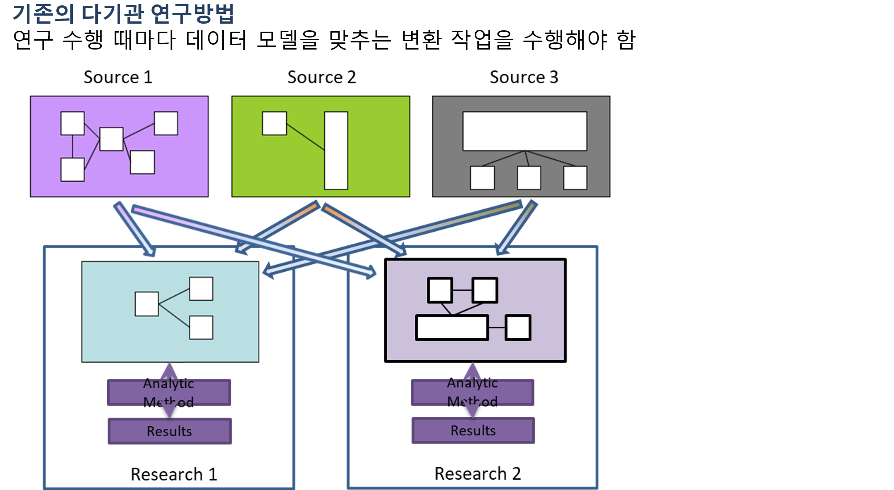</a>
</center>

출처: 유승찬교수님 슬라이드.


---
# Why CDM(2)

<center>
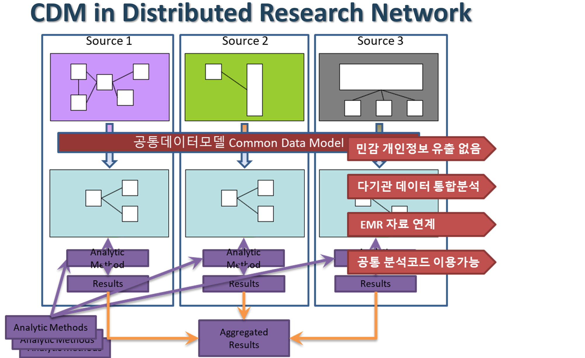</a>
</center>

---
# Why CDM(3)

<center>
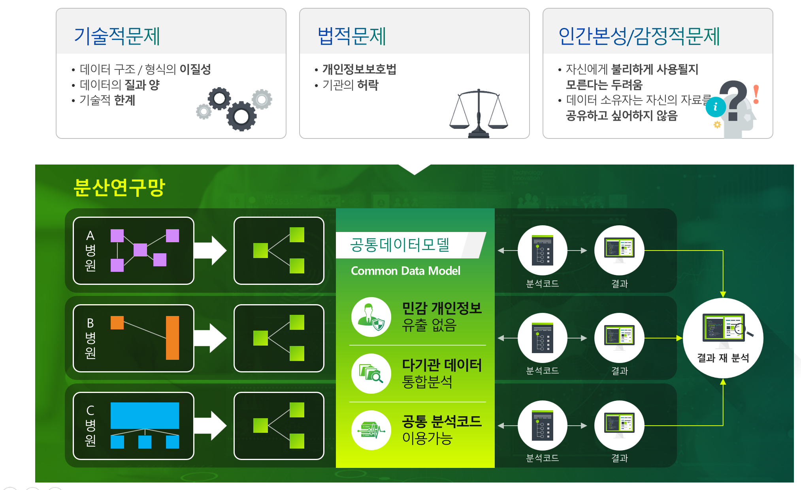</a>
</center>

---
# OMOP CDM

**OMOP (2008-2013)** www.omop.org

- OMOP = Observational Medical Outcomes Partnership
- Research on methods for drug safety evaluation
- Methods library developed; positive/negative drug outcome pairs
- Common Data Model (then, was a byproduct)
- Foundation for the NHI
- Transition to Reagan Udall Foundation for the FDA

**OHDSI** (after 2013) www.ohdsi.org
- OHDSI = Observational Health Data Science and Informatics
- Continues to use the name ‘OMOP CDM’
- Community of researchers; public; non-pharma funded

---
# OMOP CDM V6

<center>
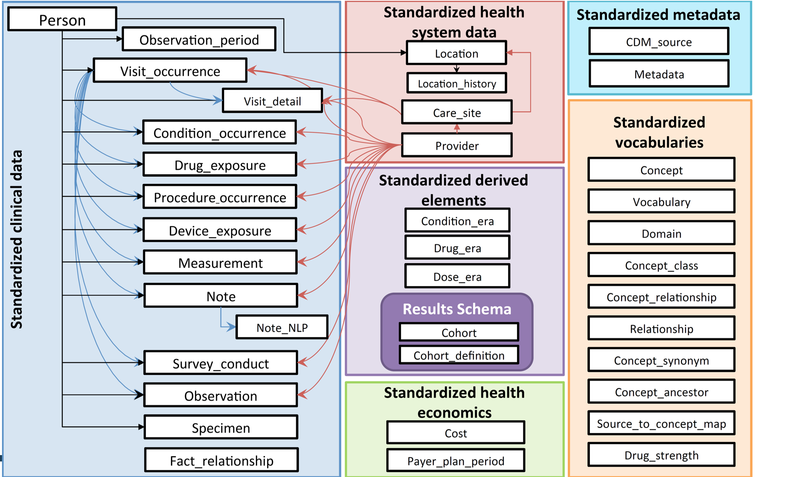</a>
</center>

동일한 데이터 구조 뿐 아니라 OMOP 코드라는 공통 의료용어체계를 이용해 물리/논리적 공통모델을 사용함

---
# Standardized Vocabulary 예

<center>
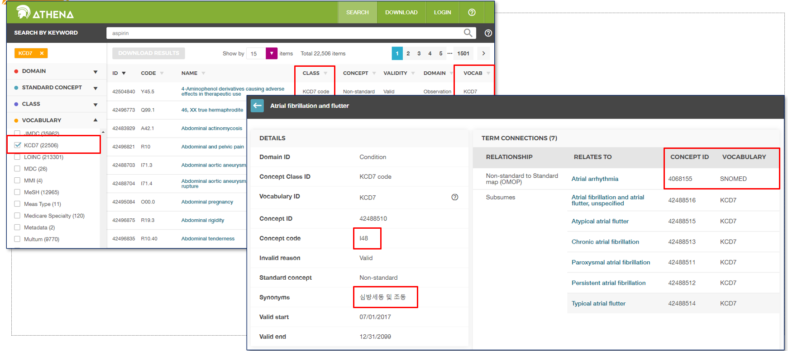</a>
</center>

---
# 국내 참여 병원

<center>
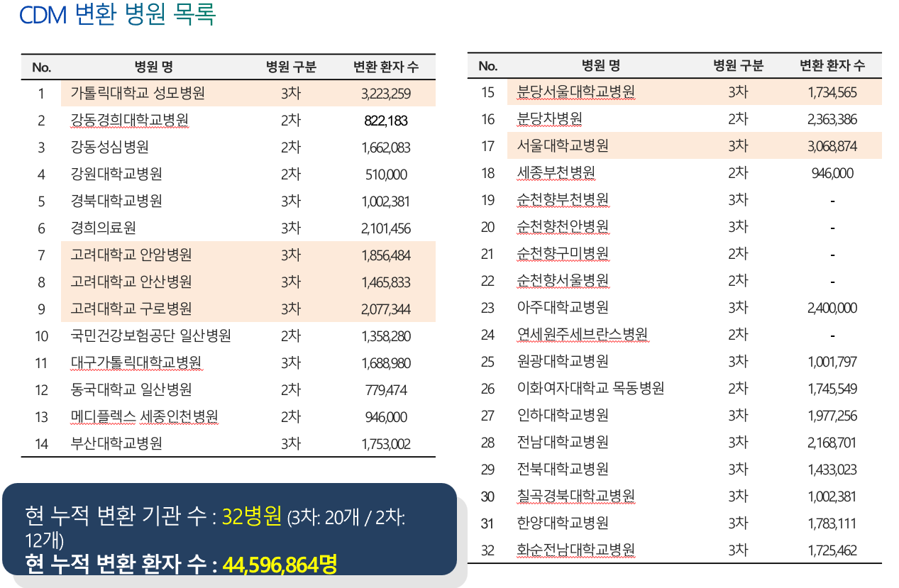</a>
</center>


---
class: center, middle

# CDM with R

---
# R first

.large[
CDM 분석 모든과정은 [R패키지](https://github.com/OHDSI)로 구현됨.
]

<center>
</a>
</center>


---
# 분석코드, 결과도 R패키지

.large[
연구설계, 분석방법이 포함된 자체 R패키지가 코드공유 표준. 

- R패키지를 여러 기관에서 실행
]

https://github.com/zarathucorp/RanitidineCancerRisk

--
.large[
분석결과는 R Shiny로 

- 실행결과를 R기반 웹애플리케이션으로 표현

- 분석코드에 웹코드도 포함되어있음.
]


---
# [ATLAS](https://atlas-demo.ohdsi.org/)

.large[
웹기반 연구설계: R 몰라도 가능
]

<center>
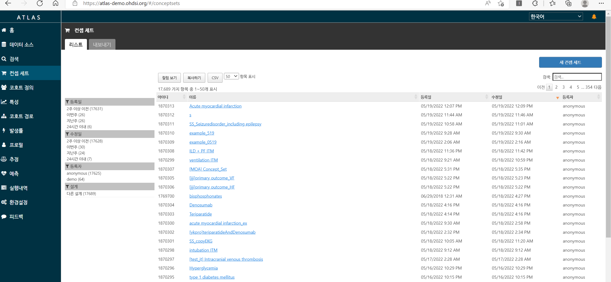</a>
</center>


---
# 데이터 소스

.large[
데이터 선택: 기본정보 제공
]

<center>
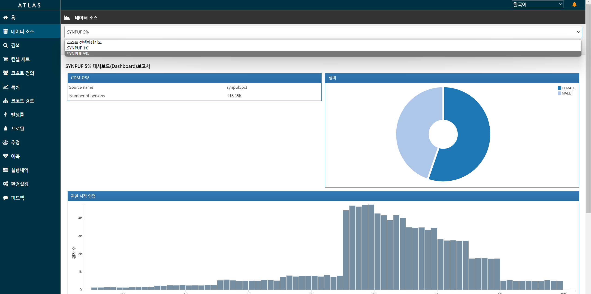</a>
</center>

---
# 컨셉세트

.large[
연구에 이용할 개념 정의
- 예: 고혈압, ACEI, PCI..

- 사망은 기본으로 있음
]

<center>
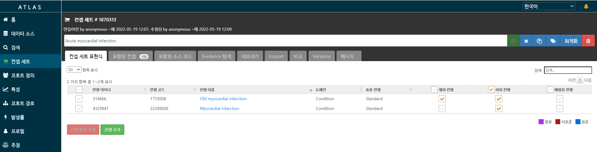</a>
</center>

---
# 코호트 정의


.large[
컨셉세트 이용해 코호트 정의

- 최소 Target/Control/Outcome 코호트 3개 필요

- Negative control 도 필요(자체만들기 or 기본제공)

]

<center>
</a>
</center>


---
# 분석

.large[
추정: Logistic/Cox

예측: xgboost, Lasso, 딥러닝

]

<center>
</a>
</center>

---
# R패키지 다운

.large[
 컨셉, 코호트, 분석이 모두 포함된 R 패키지 다운로드
]

<center>
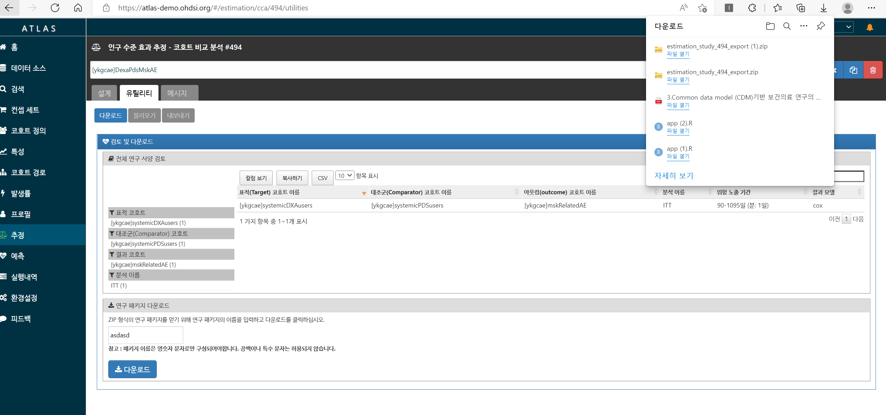</a>
</center>

.large[
이후 (1)각 병원의 RStudio server 접속, (2)패키지 설치, (3)실행 하여 분석결과 zip 파일 얻음.  

]


---
# Feedernet 이용

.large[
가장 쉬운 방법
- R코드 안봐도됨.

- 다기관메타 쉽게 가능(분석할 병원 추가로 끝)

단점
- ATLAS 에서 지원하는 분석만 됨. 직접 수정한 R패키지 불가 

- 접근권한 얻은 병원만 분석 가능. 소속, 신분에 따라 다름

]

--
.large[
분석은 심플하되, 다기관 물량으로 승부하는 컨셉 

]


---
# 단계

.large[
**(1) Feedernet 에서 Atlas, 분석실행 둘다**
- Atlas에서 지원하는 분석, Feedernet 허가된 데이터만 분석가능
 

**(2) Feedernet/각병원 Atlas로 설계, 분석은 R서버 접속.**
- Atlas에서 지원하는 분석, 자체 CDM설치병원의 데이터 분석가능

**(3) 설계도 R로, 분석도 R서버 접속**
- 자유롭게 분석설계 가능, 자체 CDM 설치병원의 데이터 분석가능 
]


---
# Textbook

.large[
공식 교과서: 친절한 예제, [영어버전은 무료공개](https://ohdsi.github.io/TheBookOfOhdsi/)

[공식 유튜브](https://www.youtube.com/watch?v=dr9FhEkf04o&list=PLSKQ1ikU3kiHk7OTa234TEPgg2il21Jol)
]

<center>
</a>
</center>


---
class: center, middle

# CDM 연구지원경험


---
# 심평원 Covid-19 데이터

- 한시적 오픈 with CDM버전,  패키지 만들어 심평원 보내면 실행결과만 보내줌.

<center>
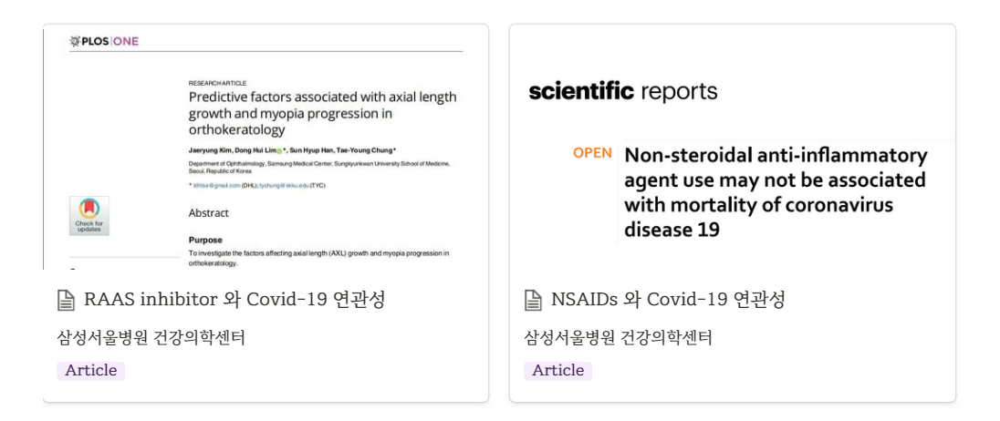</a>
</center>

[RAAS vs Other HTN drug in Covid-19](http://147.47.68.165:1111/cdm/aceiarbv5/)

- https://journals.plos.org/plosone/article?id=10.1371/journal.pone.0248058#pone-0248058-g001

[NSAIDs vs AAP in Covid-19](http://147.47.68.165:1111/cdm/nsaidaapv5/)

- https://www.nature.com/articles/s41598-021-84539-5


---
# 강동성심병원

- 첫 CDM 연구, ATLAS로 패키지만들고 강동성심 DB 접속해 R 실행

- Kaplan-meier 그림을 논문용으로 업그레이드

<center>
</a>
</center>

https://onlinelibrary.wiley.com/doi/abs/10.1111/jgh.14983


---
# 공단표본코호트 V1

- CDM 변환된 공단표본코호트와, [원본 표본코호트 결과](http://147.47.68.165:1111/doctorssi/PPI_NHIS/) 비교

<center>
</a>
</center>

---
# 공단표본코호트 V1(2)

- CDM 변환된 공단표본코호트 이용

<center>
</a>
</center>

---
# [Feedernet](https://feedernet.com) 다기관메타

- [ACEI vs ARB](http://147.47.68.165:1111/cdm/meta-drugcancer/)

<center>
</a>
</center>
<center>
</a>
</center>

---
# [Feedernet](https://feedernet.com) 다기관메타(2)

- [ACEI_ARB vs OtherHTNdrug](http://147.47.68.165:1111/cdm/meta-drugcancer/)

<center>
</a>
</center>


---
# [Feedernet](https://feedernet.com) 다기관메타(3)

- [ACEI vs ARB](http://147.47.68.165:1111/doctorssi/meta_osteoporosis/)

<center>
</a>
</center>
<center>
</a>
</center>


---
# [Feedernet](https://feedernet.com) 다기관메타(4) 


>Dear Dr Kim,

>Re: "Impact of pitavastatin on new-onset diabetes mellitus compared to atorvastatin and rosuvastatin: A distributed network analysis of 10 real-world databases"

>We are delighted to let you know that the above submission, which you co-authored, has been accepted for publication in Cardiovascular Diabetology.

>Please contact the corresponding author if you would like further details on this decision, including any reviewer feedback.

>Thank you for choosing Cardiovascular Diabetology and we look forward to publishing your article.

>Kind regards, 

>Editorial Assistant
>Cardiovascular Diabetology

---

# Executive summary

.large[
- 연구지원법인 차라투 운영하면서 CDM 공동연구 진행 

- CDM은 병원들의 데이터를 똑같은 형태로 만든다.

- 하나의 분석코드로 다기관메타분석 가능

- 분석 전과정에 R을 이용하나, [Feedernet](https://feedernet.com/) 에서 R없이 기본분석 가능. 
]


---

class: center, middle

# END
