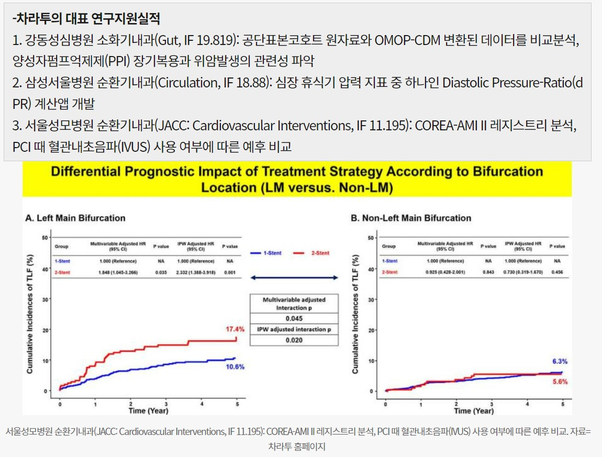
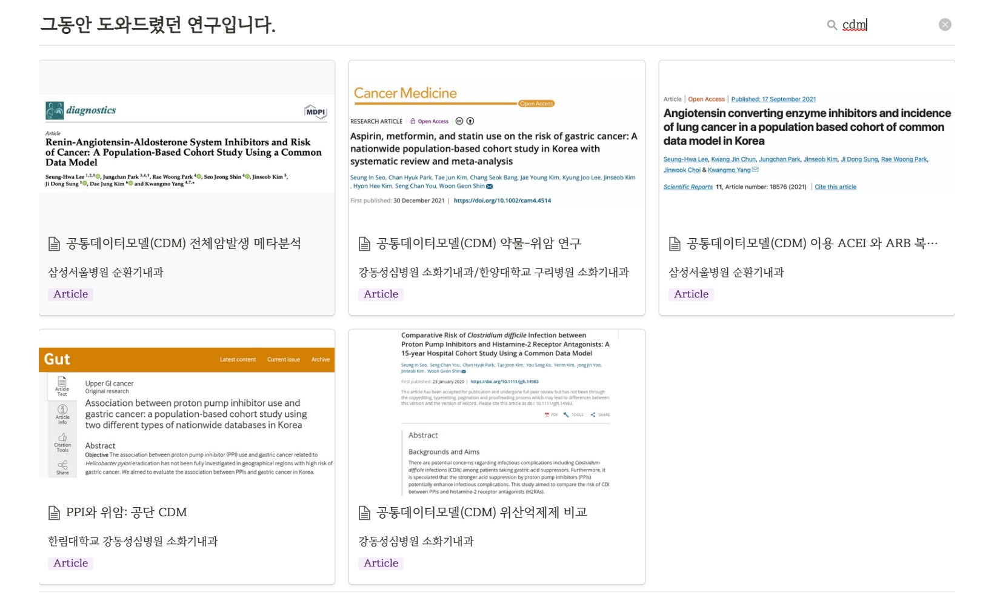

```{r setup, include=FALSE}
options(htmltools.dir.version = FALSE)
knitr::opts_chunk$set(echo = FALSE, fig.align = "center")
library(knitr);library(DT);library(shiny)
```


layout: true

<div class="my-footer"><span><a href="https://www.zarathu.com">Zarathu Co.,Ltd</a>   
&emsp;&emsp;&emsp;&emsp;&emsp;&emsp;&emsp;&emsp;&emsp;&emsp;&emsp;&emsp;&emsp;
&emsp;&emsp;&emsp;&emsp;&emsp;&emsp;&emsp;&emsp;&emsp;&emsp;&emsp;&emsp;&emsp;
<a href="https://github.com/jinseob2kim">김진섭</a></span></div> 


---
# Executive summary

.large[
**자체데이터**:  웹기반 실시간 분석서비스.

- 웹에서 실시간 분석수행 후 Excel/PPT 다운로드
]

--

.large[
**CDM 다기관 메타분석** 서비스
- Table 1 합치기, Forest/Funnel plot 등
]
--

.large[
[R](https://www.r-project.org/) 로 **보험공단/심평원 빅데이터 분석**가능.
- 공단표본코호트 V1 은 내부 분석환경 구축

- 공단표본코호트 V2, 심평원 데이터는 원격 분석환경 이용

]

---

class: center, middle


# 소개 


---
# 맞춤형 통계웹


---
# [공개 통계웹](http://app.zarathu.com) 


---
# 주요 계약 


- 대한심혈관중재학회 [COBIS III 레지스트리](https://clinicaltrials.gov/ct2/show/NCT03068494) 분석: [추가계약](http://pf.kakao.com/_XsuxgC/48388190)


- 서울성모병원 [COREA-AMI II 레지스트리](https://clinicaltrials.gov/ct2/show/NCT02806102) 분석: [10개 연구 계약](http://pf.kakao.com/_XsuxgC/48043955)


- 삼성서울병원 [공통데이터모델(CDM)](http://www.feedernet.org/html/?pmode=cdmdrn) 분석: [심평원 코로나데이터](https://hira-covid19.net/) 분석 중 


- 강동성심병원 CDM 분석지원: 공단표본데이터 분석 중 


- 경기도감염병관리지원단 코로나 대시보드 with Shinykorea: [최종보고](https://shinykorea.github.io/corona-activityrecord) 


- 삼성서울병원 이식외과 육종(sarcoma) 데이터 분석: [5개 연구 계약](http://pf.kakao.com/_XsuxgC/51701089) 


- 해운대백병원 정신질환 네트워크분석: [논문 5편](http://pf.kakao.com/_XsuxgC/52664370) 게재


- 성균관의대 환경역학연구실 [미세먼지 대시보드](http://pf.kakao.com/_XsuxgC/43627405)


- [삼성서울병원 정신과, 응급의학과, 임상역학센터 통계자문계약](http://pf.kakao.com/_XsuxgC/55192190)

- [서울대병원 순환기내과 통계자문계약](http://pf.kakao.com/_XsuxgC/55577702)


---
# 주요 논문 성과 

.large[
SCI 논문 200건 지원
]
<center>
</a>
</center>


---
# 정부지원사업 선정

<center>
</a>
</center>


---
# 채용

.large[
비대면스타트업육성사업: 의대생 5인 
- 100% 원격근무, 방학때만 출근 병행


[청년디지털일자리지원사업](https://www.work.go.kr/youthjob/intro/dgtjbIntro.do): 통계전공 5인 
- 기존 채용인원만큼 TO 얻음

]


---
class: center, middle

# 핵심기술 R 

---
# 프로그램 개발, 블로그 운영

.large[
[R](https://www.r-project.org/) packages

- [jstable](https://github.com/jinseob2kim/jstable): 논문용 테이블 만들기


- [jskm](https://github.com/jinseob2kim/jskm): 생존분석 그림 만들기


- [jsmodule](https://github.com/jinseob2kim/jsmodule): 웹에서 하는 통계분석
]

--
.large[
데이터 분석용 가상머신([docker](https://www.docker.com/) image)

- [rshiny](https://github.com/jinseob2kim/docker-rshiny): [Rstudio](https://www.rstudio.com/)와 [shiny server](https://www.rstudio.com/products/shiny/shiny-server/) 가 설치된 이미지.
]
--
.large[
[블로그](https://blog.zarathu.com/), 카카오톡 오픈채팅방- 프로그래밍 갤러리 R 유저 모임
]

---
# 80,000 다운로드

<center>
</a>
</center>


---

# 공부모임: Shiny 밋업

.large[
https://github.com/shinykorea/Meetup

- 월 1회 공부내용 공유. 30회 진행 

- 의료/유전학/축산/반도체/게임/IPTV/회계 등 다양한 분야 사람들이 모임. 

- **경기도 코로나 대시보드 공동작업**

- 21년 공개SW기반 **커뮤니티** 지원사업, **韓中日 공개SW** 국제협력 강화 TASK 선정


]


---
# 경기도 코로나 [병상관리 대시보드](https://github.com/shinykorea/corona-sickbed)


---
# 바이오헬스 규제과학과

.large[
겸임교수로 R데이터분석 3학점 강의예정(월 19-21시)
]

<center>
</a>
</center>


---
class: center, middle


# CDM 다기관 메타분석 서비스 


---
# [Meta분석 웹서비스](http://app.zarathu.com/meta-analysis/)

논문쓰려면 다기관 CDM 결과를 합쳐야됨
- 합친 table 1, forestplot, funnelplot 등 


---
# [출판논문](https://www.zarathu.com/portfolio)





---

class: center, middle

# 공공빅데이터분석

---
# KNHIS

.large[
표본코호트 
- V1(02-13): 파일 보유, 자체 RStudio server에 구축

- V2(02-15): 구매 후 원격접속(접속할때마다 SMS 인증)


맞춤형 데이터
- 명동/원주 분석실 가야함.

- 데이터 신청과정에서 분석언어 선택: SAS vs R/python 
]

--
.large[
**CRAN 패키지만 설치가능**, github 패키지 불가
- R version 문제로 CRAN 패키지도 설치안되기도..
]


---
# HIRA

.large[
맞춤형 데이터 
- **원격분석 가능**

- **고정 IP 필수**, 2개 IP만 등록가능

- 마찬가지로 **CRAN 패키지만 설치가능**
]


---
class: center, middle

# END
