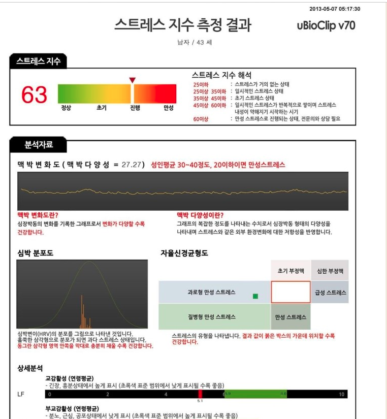
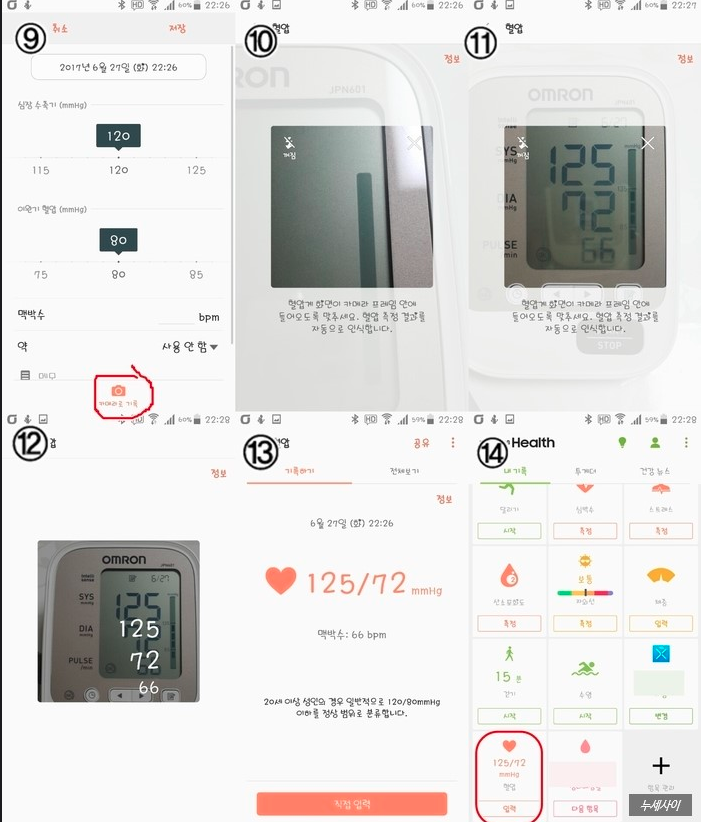

```{r setup, include=FALSE}
options(htmltools.dir.version = FALSE)
knitr::opts_chunk$set(echo = FALSE, fig.align = "center")
library(knitr);library(DT);library(shiny)
```


layout: true


---

# Executive Summary 

.large[

* 모바일/웨어러블로 여러 건강지표들을 측정, 기록할 수 있다.


* 모바일에서 내 의료기록을 확인하고 보험청구를 할 수 있다.


]


---
class: center, middle

# 측정, 기록


---
# 스트레스 

.large[
심박수와 자율신경계

* 심박이 **적당히 불규칙**해야 건강하다.

    + 환경변화에 유연하게 대처

* 스트레스 상태일수록 심박은 규칙적: 적응력 떨어짐

]

---

<center></center>


---

# 삼성 헬스 

갤럭시 플래그쉽, 기어시리즈는 **심박센서**가 있음.

    + 심박, 스트레스, SpO2 동시 측정

<center><a href="https://www.youtube.com/watch?v=F8dUUm8O_VA"></center>


---

# 심박수

.large[
대다수 웨어러블에는 **실시간 심박측정** 기능이 있음.
]


<center></center>


---

# 심박수: 삼성헬스

<center></center>


---

# SpO2

Garmin 제품은 **실시간 SpO2**도 측정. **수면무호흡 의심** 가능.

<center></center>


---
# 수면 

**뒤척임, 심박** 정보로 수면 단계 추정. 


<center></center>


---

# 수면: 갤럭시 기어

<center></center>


---

# 혈압, 혈당 

혈압/혈당계 결과 카메라로 인식 가능.

<center></center>


---

# 걷기: 캐시지급 

<center></center>


---

# 캐시워크 vs 스텝업

<iframe width="800" height="480" src="https://www.youtube.com/embed/l-l-W2DLMnI" frameborder="0" allow="accelerometer; autoplay; encrypted-media; gyroscope; picture-in-picture" allowfullscreen></iframe>


---

class: center, middle

# 실손보험청구 


---

# 100만원 이하 모바일 청구

서류는 사진찍어 업로드

* [토스 병원비 돌려받기](https://blog.naver.com/PostView.nhn?blogId=shipbest&logNo=221674014883&from=search&redirect=Log&widgetTypeCall=true&directAccess=false)

* [바로청구](https://baro.kwic.co.kr/)


---
# 토스

<center>
<iframe width="800" height="480" src="https://www.youtube.com/embed/iS3eFtXEuNw" frameborder="0" allow="accelerometer; autoplay; encrypted-media; gyroscope; picture-in-picture" allowfullscreen></iframe>
</center>


---
# 바로청구

<center>
<iframe width="800" height="480" src="https://www.youtube.com/embed/vKq0XZ6LhHk" frameborder="0" allow="accelerometer; autoplay; encrypted-media; gyroscope; picture-in-picture" allowfullscreen></iframe>
</center>


---

# 서류 필요없음: 메디패스

블록체인 기술 활용, 현재 서울대병원과 삼성서울병원만 가능.


<center>
<a href="https://blog.medibloc.org/timeline/products/medipass/6639"></a>
</center>

---

class: center, middle

# END


