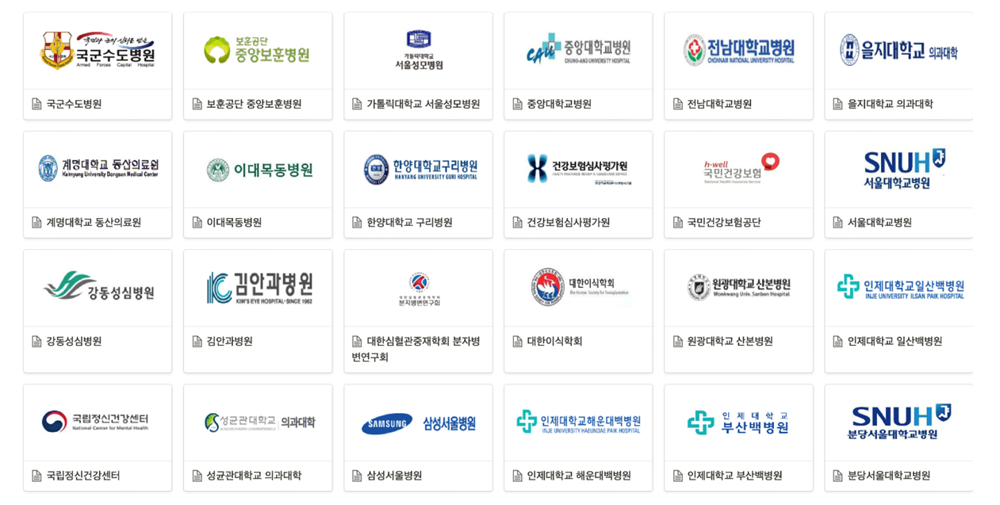
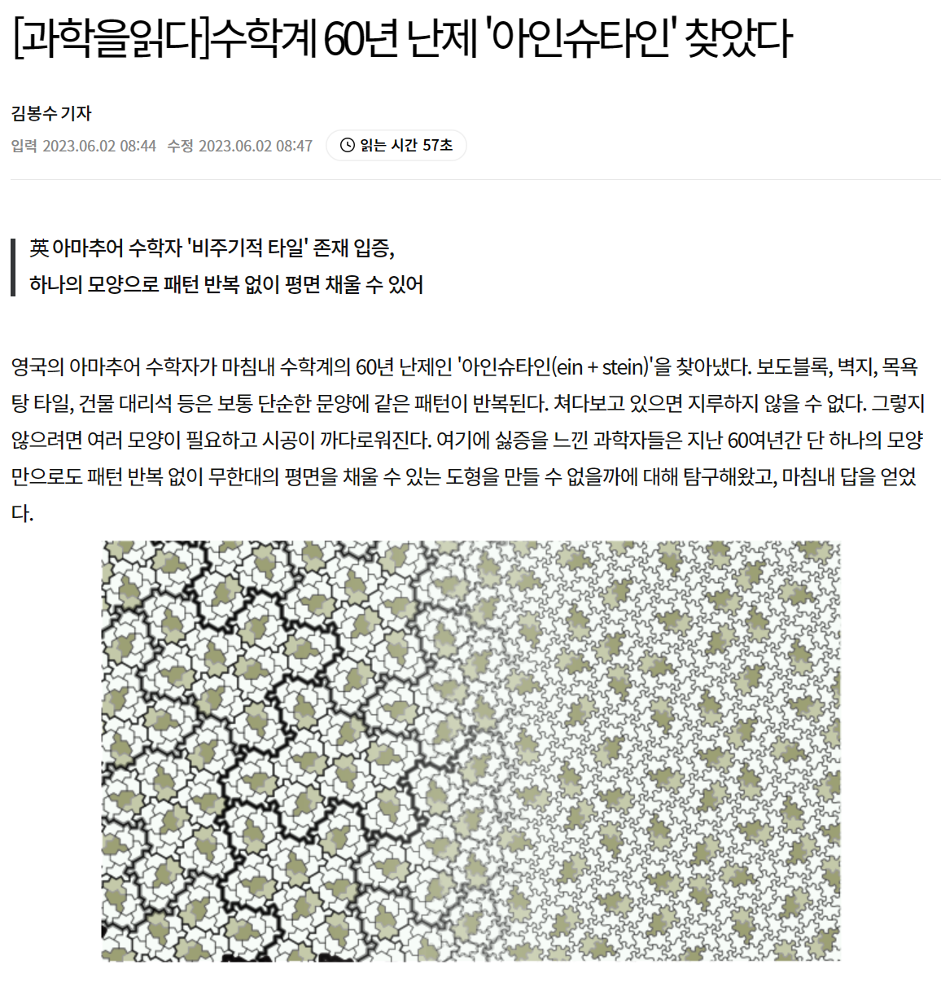
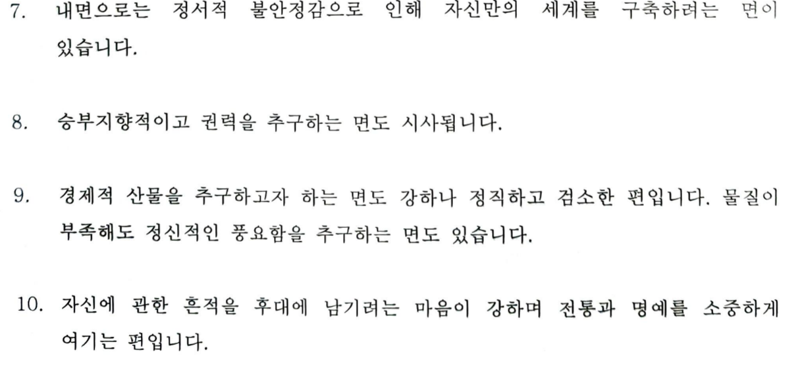

```{r setup, include=FALSE}
options(htmltools.dir.version = FALSE)
knitr::opts_chunk$set(echo = FALSE, fig.align = "center")
library(knitr);library(DT);library(shiny);library(survival);library(survey)
for (v in c("sex", "status")){
  colon[[v]] <- factor(colon[[v]])
}
data(nhanes)
nhanes$HI_CHOL <- factor(nhanes$HI_CHOL)
nhanes$race <- factor(nhanes$race)
nhanes$RIAGENDR <- factor(nhanes$RIAGENDR)
```


layout: true

<div class="my-footer"><span><a href="https://www.zarathu.com">Zarathu Co.,Ltd</a>   
&emsp;&emsp;&emsp;&emsp;&emsp;&emsp;&emsp;&emsp;&emsp;&emsp;&emsp;&emsp;&emsp;
&emsp;&emsp;&emsp;&emsp;&emsp;&emsp;&emsp;&emsp;&emsp;&emsp;&emsp;&emsp;&emsp;
<a href="https://github.com/jinseob2kim">김진섭</a></span></div> 


---

# Executive summary


- 수학올림피아드 + 의대 = 의학통계(예방의학)

- 의학통계 + IT기업(삼성전자 무선사업부) = 창업(의학통계)

- 연매출 1.5억 + 파트타임 job = 소상공인(투자없이생존)

- 소상공인 + 정부지원(사업비, 사무실) = 스타트업

- 의학연구지원 $\rightarrow$ 임상시험분석시장 진출


--

- 천하3분지계: 법학, 의학, 종교

- 사람을 살리고 널리 인간을 이롭게하는 **홍익인간**

- 김옥균, 맹상군, 유비

 
--

- 문제해결 $\rightarrow$ 문제정의 $\rightarrow$ **아름다움** $\rightarrow$ **신내림**


---
class: center, middle


# 창업하기까지 

---

# 수학올림피아드 

수학과만 생각했는데 의대 입학 

- 1학기 수시: 올림피아드 전형 

--

의대 적응 못함

- 6년內 면허취득 마지노선

- 인턴 탈락

--

학원강사 

- 본과 2학년말부터 대치 위OO.

- 30살까지 수원 프OOOO, 대치 위OO. 


---

# 예방의학

전공의 

- [서울대 보건대학원](http://health.snu.ac.kr/node/104) 예방의학교실 

- **임상의학 아님**. 관악캠퍼스 소속으로 타 과와의 연계가 장점. 


석사 및 박사 수료

- 서울대 보건대학원 [유전체역학 연구실](http://snugepi.snu.ac.kr/) 

- 유전체 데이터 분석 방법론 연구.


[R](https://www.r-project.org/), [python](https://www.python.org/), 리눅스 이용 시작. 지인 상대로 통계 자문 시작. 

---

# [삼성전자](http://health.chosun.com/news/dailynews_view.jsp?mn_idx=165897) 

박사과정과 응급실 당직 병행 중, 지도교수님 통해 우연히 제의받음.

- 면접 후 2년 3개월 계약직으로 입사. 

DMC 연구소로 입사 10개월만에 무선사업부로 이동. 

- 연구소에서는 디지털헬스 선행 기술 개발팀, 사업부에서는 **삼성헬스** 앱 개발팀.


<center>
<a href="https://newsimg.sedaily.com/2018/08/05/1S38RAKVMO_1.jpg/"></a>
</center>

---

# 삼성전자에서 만난 의사.
.large[
- 중앙의대卒, 진단검사의학 전문의, 現 근무

- 연세의대 03학번(WELT 대표), 인턴中 무선사업부 입사, 사내벤처 1호.

- 美 소아과 의사
]

---

# 사내벤처 C-lab
.large[
사내 우수 아이디어 선발, 1년 과제 진행後 스핀오프 결정. 
]

.center[

]

거북목관리 안경테, 1day 통계지원 서비스로 지원했으나 광탈.


---

# 퇴사 

.large[
2년차 중반 퇴사 결심. 

- 한국수력원자력 탈락. 

- 한국투자파트너스, 스틱인베스트먼트 VC 탈락. 


의료 쪽 일을 병행하며 의대 입시컨설팅에 도전하기로 함. 
]

--

.large[
의대 입시 컨설팅은 시작도 못함, 박사과정을 마치기로 결정. 
]

---

# 박사과정 

.large[
물리학에 빠짐. 일반상대성이론과 양자역학에 감명받음. 

- 이론연구자가 되기로 결심하고 통계이론 논문을 작성. 

- 해외 논문 게재 실패. 박사 학위도 어려움.

- 결국 자체 [블로그](https://blog.zarathu.com/posts/2018-11-08-mdlm/)에 게재.
]

---

# 법인설립 

연구는 안되는데 창업 공모전은 선정되기 시작.

- ['18년 창업선도대학 (예비)창업팀](https://www.k-startup.go.kr/homepage/businessManage/businessManageFunction.do?sid=111&itemSeq=1060): 블록체인 기반 유전체-건강 빅데이터 구축 및 정밀 의학 솔루션. 

- [심평원, 보험공단 주최 보건의료빅데이터를 활용한 창업아이디어 공모전](http://www.hira.or.kr/bbsDummy.do?brdBltNo=9598&brdScnBltNo=4&pageIndex=1&pgmid=HIRAA020041000100): 맞춤형 의학연구 애플리케이션

--

창업하기로 결심, 블록체인은 엄두가 나지 않음.

- 배운게 도둑질, 원래 하던 통계지원을 하기로 결정하고 1인 법인 설립.

- 처음엔 선배, 동기들과 그들의 지인들이 주 고객. 

- 現 맞춤형/공개 통계웹, 통계컨설팅, 공공빅데이터 분석이 주 업무


---

class: center, middle


# 창업 후 ~ 現 


---
# 맞춤형 통계웹


---


---
# [공개 통계웹](https://openstat.ai) 


---
# 주요 계약 


- 대한심혈관중재학회 [COBIS III 레지스트리](https://clinicaltrials.gov/ct2/show/NCT03068494) 분석: [추가계약](http://pf.kakao.com/_XsuxgC/48388190)


- 서울성모병원 [COREA-AMI II 레지스트리](https://clinicaltrials.gov/ct2/show/NCT02806102) 분석: [10개 연구 계약](http://pf.kakao.com/_XsuxgC/48043955)


- 삼성서울병원 [공통데이터모델(CDM)](http://www.feedernet.org/html/?pmode=cdmdrn) 분석: [심평원 코로나데이터](https://hira-covid19.net/) 분석 중 


- 강동성심병원 CDM 분석지원: 공단표본데이터 분석 중 


- 경기도감염병관리지원단 코로나 대시보드 with Shinykorea: [최종보고](https://shinykorea.github.io/corona-activityrecord) 


- 삼성서울병원 이식외과 육종(sarcoma) 데이터 분석: [5개 연구 계약](http://pf.kakao.com/_XsuxgC/51701089) 


- 해운대백병원 정신질환 네트워크분석: [논문 5편](http://pf.kakao.com/_XsuxgC/52664370) 게재


- 성균관의대 환경역학연구실 [미세먼지 대시보드](http://pf.kakao.com/_XsuxgC/43627405)


- [삼성서울병원 정신과 통계자문계약](http://pf.kakao.com/_XsuxgC/55192190)

- [서울대병원 순환기내과 통계자문계약](http://pf.kakao.com/_XsuxgC/55577702)

- 기타: 제약/바이오, 임상시험SW, 디지털치료기기 스타트업 등 

---
# 주요 논문 성과 

.large[
SCI 논문 200건 지원
]
<center>
</a>
</center>


---
# NEJM

.large[
심혈관중재시술 전략비교

> 삼성서울병원 이주명, 최기홍 교수님을 도와 두 심혈관중재시술(PCI) 전략을 비교, 다기관 고려한 stratified cox 와 competing risk analysis 를 수행하고 관련 통계자문을 제공하였습니다. 본 연구는 New England Journal of Medicine(NEJM, IF 176.079) 에 게재되었습니다.
]

<center>
</a>
</center>

---
# LANCET

.large[
Statin 병용요법 비열등성검정

> 연세의료원 심장내과 홍명기교수 팀을 도와 high-intensity statin 단일요법과 ezetimibe + moderate-intensity statin 병용요법을 비교, (1)비열등성검정 샘플수 계산 및 통계검토와 (2)리비전 통계분석을 지원하였습니다. 본 연구는 The Lancet(IF 202.731) 에 게재되었습니다
]

<center>
</a>
</center>

---
# JAMA

Statin 치료전략 비교

> 연세의료원 심장내과 홍명기교수 연구팀을 도와 LODESTAR (Low-Density Lipoprotein Cholesterol-Targeting Statin Therapy Versus Intensity-Based Statin Therapy in Patients With Coronary Artery Disease) Trial 을 분석, statin 치료전략을 비교하고 리비전에 필요한 통계자문을 제공했습니다. 본 연구는 JAMA(IF 157.3) 에 게재되었습니다.

<center>
</a>
</center>


---
# 병원고객


<center>
</a>
</center>

- 강동/동탄성심, 상계/일산백, 길, 고대안암병원과 연단위 계약 체결


---
# 임상시험시장 진출

- 신라젠과 연단위 계약 체결, EverEX 확증임상시험 승인 지원

<center>
</a>
</center>


---
# 정부지원사업 선정

<center>
</a>
</center>


---
# 22년 IITP 연구개발과제 선정 

.large[
2년 10.5억 with 앤틀러, 파이디지털헬스케어
]
<center>
</a>
</center>

---
# R&D: statgarten

.large[
총괄책임자

- with 파이디지털헬스케어, 앤틀러

]

<center>
</a>
</center>


---
# 22년 창업도약패키지 선정

.large[
1억
]
<center>
</a>
</center>


---
# 심평원 공통데이터모델 변환 용역

<center>
</a>
</center>


---
# 23년 공개SW기술확산사업

(의학연구위한) 오픈소스 SaaS 의료데이터 분석서비스
- NIPA(7개월, 2억)

<center>
</a>
</center>

---
# 창업성장기술개발 디딤돌

.large[
의학 연구를 위한 의료 데이터 분석 웹
- 중기부(1년, 1.2억)
]

<center>
</a>
</center>

---
# 가상환경 의료기술 개발사업

 "더 나은 환자 경험을 위한 클라우드 기반 디지털 의료서비스 모델 개발 및 실증"
- 보건복지부(5년 50억원)
- 주관: 연세대학교 산학협력단
- 공동: 분당차병원, 원주 연세대학교, 레몬헬스케어, 월드버텍, 차라투
- 차라투는 "AI 챗봇기반 사전 예진실 서비스" 담당


<center>
</a>
</center>


---
# 재무 & 팀

.large[
최근 2년간 평균 매출 성장률 100%

- 21년 1.45억 -> 22년 2.74억 -> 23년 5.82억(원) 
- 창업 후 투자, 대출 없이 운영중 

팀원 8명(평균나이 27세), 인턴 4명(의사 2명)

- R 패키지 개발자 2명, 백엔드 개발자 1명, 분석가 3명, 의사 1명, 마케팅 1명
- 100% 원격근무, 재량근로제 계약
]


---
class: center, middle

# 핵심기술 R 

---
# 프로그램 개발, 블로그 운영

.large[
[R](https://www.r-project.org/) packages

- [jstable](https://github.com/jinseob2kim/jstable): 논문용 테이블 만들기


- [jskm](https://github.com/jinseob2kim/jskm): 생존분석 그림 만들기


- [jsmodule](https://github.com/jinseob2kim/jsmodule): 웹에서 하는 통계분석
]


--
.large[
데이터 분석용 가상머신([docker](https://www.docker.com/) image)

- [rshiny](https://github.com/jinseob2kim/docker-rshiny): [Rstudio](https://www.rstudio.com/)와 [shiny server](https://www.rstudio.com/products/shiny/shiny-server/) 가 설치된 이미지.
]
--
.large[
[블로그](https://blog.zarathu.com/), 카카오톡 오픈채팅방- 프로그래밍 갤러리 R 유저 모임
]


---

<center>
</a>
</center>


---
# 150,000 다운로드

<center>
</a>
</center>


---
# 발표: 개발환경구축
<center>
</a>
</center>

---
# 발표: R패키지 개발 후기
<center>
</a>
</center>


---

# 공부모임: Shiny 밋업

.large[
https://github.com/shinykorea/Meetup

- 월 1회 공부내용 공유. 30회 진행 

- 의료/유전학/축산/반도체/게임/IPTV/회계 등 다양한 분야 사람들이 모임. 

- **경기도 코로나 대시보드 공동작업**

- 21년 공개SW기반 **커뮤니티** 지원사업, **韓中日 공개SW** 국제협력 강화 TASK 선정


]


---
# 경기도 코로나 [병상관리 대시보드](https://github.com/shinykorea/corona-sickbed)


---
# 프로그래밍갤러리 R 유저모임

.large[
디시인사이드 프로그래밍 갤러리 고정닉 활동: **[김옥균](https://gallog.dcinside.com/jinseob2kim)**

카카오톡 오픈채팅방 운영: 닉네임 大逆不道玉均
]

<center>
</a>
</center>


---

class: center, middle


# 꿈

---
# 지금만으로도 행복

.large[
- 수학 적성 살리면서 일할 수 있어서 행복

- 사람을 살리는 일이어서 행복 

- 연구지원하며 동기, 선후배, 교수님 많이 만날 수 있어 행복

- R을 매개로 의학 외 다양한 분야 사람들과 교류할 수 있어 행복

- 학원강사 본능도 만족시킬 수 있어 행복
]


---
# 바이오헬스 규제과학과

.large[
겸임교수로 [R빅데이터분석](https://github.com/jinseob2kim/R-skku-biohrs) 3학점 강의(월 19-21시)
]

<center>
<a href="https://github.com/jinseob2kim/R-skku-biohrs"></a>
</center>


---
# [SW마에스트로 멘토](https://www.swmaestro.org/sw/main/contents.do?menuNo=200034)
.large[
- 과기정통부, 정보통신기획평가원 주관 SW인재양성사업

- 기술멘토 60인 선발: 23년까지 임기

<center>
</a>
</center>


]


---
# 목숨바칠만한 일 

.large[
이식외과 희귀암환자 췌장절제여부 데이터
- 최악과 차악뿐인 선택지를 두고 눈물흘리는 환자들과 의료진이 떠오름 

- 나도모르게 눈물이 남.

- 의학연구자 = 어벤저스, 차라투 = 어벤저스지원
]


---
# 지금 목표 

.large[
- 고객 분석 및 연구디자인 자문

- 창업지원사업, R&D 계획서

- IITP, 디딤돌 과제평가 무난히..

- 일본 진출

- 인턴쉽 유망주 육성
]


---

</a>


---
# 장기 목표

<center>
</a>
</center>


---
# Load to 天下

<center>
</a>
</center>

---
# 롤모델

<center>
</a>
</center>


---
# 수학에 대한 생각

.large[
- 난제해결(~20대): 페르마 마지막, 푸앵카레추측, 괴델불완전성

- 문제정의(30대초): 타니야마-시무라, 써스턴 기하화 추측, 힐베르트 23문제

- 아름다움(現): 갈루아 군, 파인만 다이어그램 

- 신내림(꿈): 라마누잔 
]

<center>
</a>
</center>

> 나마기리 여신으로부터 수식에 대한 계시를 받았다

---
# 수학에 대한 생각(2)

.large[
- 10대: 유일한 진실이다. 물리하면 더럽혀지는거다!

- 20대: 통계는 가짜수학이다. 허나 의대에선 이것밖에..

- 30대: 수학은 세계관이다 $0.999... = 1$ 일수도 아닐수도, 아름다운것이 선택받는다

- 40대: 수학이 날 버렸다..

]

[2+2=4 강요는 인종차별적? 수학 꼴찌권 미국은 지금 이런 논쟁 중](https://www.chosun.com/international/us/2021/11/09/DHP6ZKS2WFCVTL7TJVJPRPCD4U/)


---
# 수학에 대한 생각(3)

.large[
허준이 교수
 > "개인적으로 수학은 저 자신의 편견과 한계를 이해해가는 과정이고, 일반적으로는 인간이라는 종(種)이 어떤 방식으로 생각하고 또 얼마나 깊게 생각할 수 있는지 궁금해하는 일입니다"


]


---
# 비즈니스에 대한 생각

.large[
- 문제해결: 통계지원요청 도와준다

- 문제정의(現): 쉽게 분석할 수 있어야

- 아름다움(목표)

- 신내림(과연..)

]

<center>
</a>
</center>


---
<center>
</a>
</center>


---
# 헬스케어 업계에서 의사란?

.large[
劉(유) 씨
- 삼국지 유비: 한황실 재건 명분, 유황숙 대접, 천하통일까지? 


]


---
# 철강왕 박태준 우향우정신

.large[
> 선조의 피값(대일 청구권 자금)으로 짓는 포항제철, 실패하면 우향우해서 영일만에 빠져 죽자
]

<center>
</a>
</center>


---
# 醫俠(의협: 의학 + 의로울 협) 정신

.large[
> 환자 희생으로 만들어진 데이터, 실패하면 한강에 빠져 죽자 

- 최선의 결과를 내야하는 의료진, 최선의 결과를 원하는 환자

- But, 최악과 차악뿐인 선택지

- 선택과 사투과정이 담긴 데이터

- 이 데이터를 헛되게 쓰는건, 환자의 희생과 의료진의 노력을 헛되게 만드는 것. 

]


---
# 근성론(김성모)

.large[
> 이세상 인간들은 다 사실 외롭고 쓸쓸하다. 겉으로는 행복한척 잘난척 하지만, 대다수의 인간은 자기 스스로가 밑에서부터 고장 나고 있다는것을 자각하며 살아간다. 

> 나이를 먹는다는것은 통찰력이 생기는 것이 아니라 감각이 붕괴되는 것이다.  통찰력이 생겼다고 자부하지 말고 당신의 감각이 하나 더 붕괴됬음을 슬퍼해라. 늙어감에 예외는 없다. 

미친듯이 성장한다는 느낌이 들어야 간신히 본전.


]


---
<center>
</a>
</center>
<center>
</a>
</center>
<center>
</a>
</center>


---
class: center, middle

# END
