```{=html}
<!-- case-media-2: 사진 2장, 위아래 2칸 분할
case-media-3: 사진 3장, 위아래 3칸 분할
case-media-full: 사진 1장, 오른쪽 사진 공간 전체 사용
case-media-top: 사진 1장, 위쪽 칸만 사용하고 아래는 비워둠 -->
```

## 목차

::::::: {style="padding: 10px 40px;"}
::: highlight-box
**I. 차라투 소개** — 누가, **무엇**을 하는 회사
:::

::: highlight-box-blue
**II. 차라투가 수행한 멀티오믹스 분석** — 암·정신과·피부·호흡기 7개 사례
:::

::: highlight-box-teal
**III. 공단·심평원 데이터 연계** — 200만명 규모 연구 경험
:::

::: highlight-box-purple
**IV. 뇌졸중 연구 협업 제안** — 바로 적용 가능한 분석 전략
:::
:::::::

## 차라투 주식회사

::: spacer-xs
:::

::: accent-box
국내 유일 **의학연구지원 전문기업**. 대표 **예방의학 전문의 · 수학올림피아드 특기자** 출신으로 임상·유전체·오믹스 분석 전 영역을 아우릅니다
:::

::::::::::: columns
::: {.column width="50%"}
[**수행 범위**]{.section-title}

-   연구 설계·샘플수 계산부터 논문 투고까지 **end-to-end**
-   12시간 내 응답 보장, **200편+ SCI 논문** 지원
-   한림대·인제대·삼성서울병원 등 다수 기관 연단위 계약

[**오믹스 수행 경험**]{.section-title}

-   GWAS, PRS (PRScs · PRScsx), scRNA-seq
-   Nanostring spatial transcriptomics
-   Proteomics · lipidomics · methylation
-   xMWAS 기반 다층 네트워크 통합
:::

::::::::: {.column width="45%"}
:::::: summary-grid
::: {.summary-item .si-green}
**22만+**

R 패키지 다운로드
:::

::: {.summary-item .si-blue}
**200+**

SCI 논문 지원!!!
:::

::: {.summary-item .si-teal}
**8건**

국가 R&D 수행
:::
::::::

::: spacer-sm
:::

::: accent-box-emerald
**팀 구성** — 정규직 5명 + 인턴 7명 (의학·통계·개발 전문인력)
:::
:::::::::
:::::::::::

## 왜 멀티오믹스인가 — 단일 오믹스의 한계

::: spacer-xs
:::

::::::: columns
::: {.column width="52%"}
[**한계**]{.section-title}

-   GWAS는 표현형 변이의 **2\~8%만 설명**
-   단일 유전자(CYP2C19) 변이는 약물 반응의 **\~12%만 설명**
-   정적 '상태(state)' 관찰 → 동적 '과정(process)' 규명 필요

[**통합이 필요한 이유**]{.section-title}

-   **인과성** 규명 — MR, pQTL/eQTL
-   **약물 반응 이질성** — 동일 변이 내 반응성 차이
-   **치료 표적** 도출 — 단백체·대사체 수준
:::

::::: {.column width="48%"}
::: accent-box-emerald
**오믹스 계층** (DNA → RNA → Protein → Metabolite)

-   **Genomics / Epigenomics**
-   **Transcriptomics** — scRNA-seq, spatial
-   **Proteomics** — Olink PEA
-   **Metabolomics / Lipidomics**
:::

::: highlight-box-purple
**통합 기법** — MOFA · xMWAS · Mendelian Randomization · QTL · EWAS
:::
:::::
:::::::

## 예시: 단일 오믹스 결과 vs 다층 통합 결과

::: spacer-xs
:::

:::::::::::::::::::::::::::::: columns
:::::::::::::::: {.column width="49%"}
::::::::::::::: {.omics-compare-panel .single}
::: omics-panel-top
[Single-omics]{.omics-badge .single} [GWAS / DEG / EWAS 결과 예시]{.omics-panel-title}
:::

::: mini-volcano
[-log10(P)]{.volcano-axis-label .y} [Effect size]{.volcano-axis-label .x} [IL6]{.volcano-gene-label style="left: 71%; top: 12%;"} [CRP]{.volcano-gene-label style="left: 61%; top: 24%;"}
:::

:::::: mini-stat-strip
::: mini-stat-card
<strong>n = 1,248</strong>Case-control
:::

::: mini-stat-card
<strong>FDR \< 0.05</strong>17 hits
:::

::: mini-stat-card
<strong>Top pathway</strong>Inflammation
:::
::::::

::::::: result-rows
::: {.result-row .header}
Feature Effect Adj.P
:::

::: result-row
IL6 beta = +0.42 0.004
:::

::: result-row
CRP beta = +0.31 0.011
:::

::: result-row
CXCL8 beta = -0.27 0.019
:::
:::::::

::: panel-note
단일 계층 분석은 "무엇이 유의한가"를 선명하게 보여주지만, 오믹스 계층 간 연결 구조와 환자별 이질성은 상대적으로 제한적으로 드러납니다.
:::
:::::::::::::::
::::::::::::::::

::::::::::::::: {.column width="51%"}
:::::::::::::: {.omics-compare-panel .multi}
::: omics-panel-top
[Integrated]{.omics-badge .multi} [선택형 멀티오믹스 통합 뷰 예시]{.omics-panel-title}
:::

::: control-rack
[Genomics]{.control-pill .geno} [Transcriptomics]{.control-pill .tx} [Proteomics]{.control-pill .prot} [Metabolomics]{.control-pill .met} [Outcome]{.control-pill .outcome}
:::

::::: integration-toolbar
::: toolbar-box
<strong>Cohort</strong>BOMICS / Stroke / Validation
:::

::: toolbar-box
<strong>Filter</strong>Responder · FDR \< 0.05 · Module 3
:::
:::::

::: integration-frame
{.omics-network-img fig-alt="xMWAS multi-omics integration example" width="535"}
:::

:::::: omics-output-grid
::: output-card
<strong>Community</strong>APOC1-CRP module
:::

::: output-card
<strong>Latent factor</strong>Inflammation axis
:::

::: output-card
<strong>Interactive</strong>Layer-on/off selection
:::
::::::

::: panel-note
:::
::::::::::::::
:::::::::::::::
::::::::::::::::::::::::::::::

## 분석 전략 5단계 프로세스

::: spacer-sm
:::

:::::::::::: process-flow
::: {.pstep .pstep-1}
[STEP 1]{.step-label} [연구질문·데이터 정합화]{.step-title} [임상 질문 정의, 대상자 기준 확정, 결측/이상치/라벨 정리]{.step-desc}
:::

::: process-arrow
▶
:::

::: {.pstep .pstep-2}
[STEP 2]{.step-label} [코호트 정의·기초 비교]{.step-title} [군 정의, baseline 비교, 교란 가능성 점검]{.step-desc}
:::

::: process-arrow
▶
:::

::: {.pstep .pstep-3}
[STEP 3]{.step-label} [핵심 통계모형 적용]{.step-title} [회귀·생존·반복측정·고차원 분석을 질문별로 적용]{.step-desc}
:::

::: process-arrow
▶
:::

::: {.pstep .pstep-4}
[STEP 4]{.step-label} [검증·민감도 분석]{.step-title} [하위군/외부검증/다중검정 보정으로 결과 안정성 확인]{.step-desc}
:::

::: process-arrow
▶
:::

::: {.pstep .pstep-5}
[STEP 5]{.step-label} [해석·산출물 전환]{.step-title} [임상 해석 중심 결과표/그림/발표자료/웹앱으로 전환]{.step-desc}
:::
::::::::::::

::: spacer-sm
:::

::: accent-box
**차라투 차별점** — 통계모형 결과를 임상 질문에 맞는 **해석 가능한 근거(효과크기·위험도·분류성능)**로 전환하고, 표·그림·웹앱까지 같은 흐름으로 제공합니다.
:::

## Case 1. 양극성장애 환자 약물 치료 반응 예측 및 신호 분석

:::::: {.columns .case-slide}
::: {.column width="52%"}
[삼성서울병원 정신건강의학과 백지현 교수님]{.case-owner}

**분석 데이터**

-   양극성장애 환자의 임상정보, 약물 반응 점수, proteomics, SNP, PRS을 포함한 다각적 멀티오믹스 데이터.
-   Lithium과 Valproate 반응을 연속형 점수와 반응군 형태로 정의, 예측 성능 평가와 분자 신호 해석을 동일 프레임 내에 연결.

**분석 목표 및 통계 분석**

-   약물 반응 차이를 설명하는 임상·분자 결합 신호 탐색 후, 반응 예측에 기여하는 feature 축 도출을 위한 분석 설계.
-   [Table 1]{.stat-tech}, [linear/logistic regression]{.stat-tech}로 기본 차이를 정리한 뒤, [SNP-level GWAS]{.stat-tech}, [network analysis]{.stat-tech}, [LASSO]{.stat-tech}, [Random Forest]{.stat-tech}로 확장 진행.

**결과 및 산출물**

-   반응군 비교표, SNP-단백체-임상 통합 네트워크, 변수 중요도 기반 예측 모델 구축, `[75% train / 25% test]` 분할과 `[10-fold CV]` 기준의 성능 비교 체계 정리.
:::

:::: {.column width="48%"}
::: {.case-media .case-media-2 data-caption="상: SNP-단백체-임상 통합 네트워크 커뮤니티. 하: 보정 로지스틱 회귀 결과표 예시."}
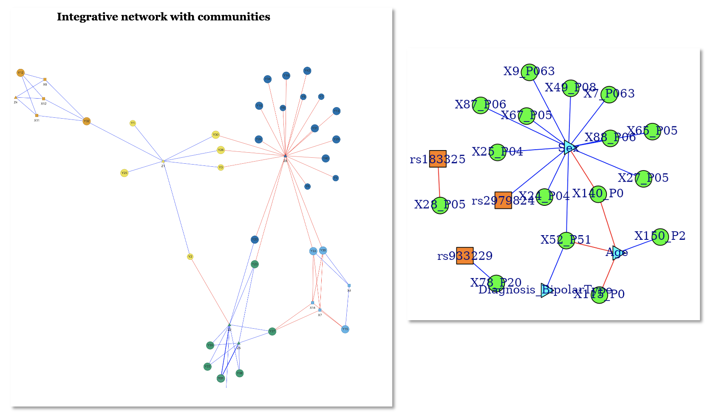{.case-img-2}

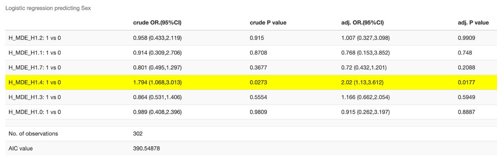{.case-img-2}
:::
::::
::::::

## Case 1. 양극성장애 환자 약물 치료 반응 예측 및 신호 분석

:::::: {.columns .case-slide}
::: {.column width="52%"}
[삼성서울병원 정신건강의학과 백지현 교수님]{.case-owner}

**분석 데이터**

-   한국인 PRS summary statistics, phenotype, eQTL/mQTL, Brain-mMeta를 통합한 멀티오믹스 데이터.
-   단순 예측 score 비교를 넘어, lead SNP와 기능 후보 유전자를 다시 해석하기 위한 post-GWAS 구조 중심 데이터셋.

**분석 목표 및 통계 분석**

-   ancestry-informed PRS 재산출을 통한 예측력 재점검 후, 기능적 근거가 더 설득력 있는 SNP-유전자 축 도출을 위한 재해석.
-   [PRScs]{.stat-tech}, [PRScsx]{.stat-tech}로 trait별 score를 산출하고 [logistic ROC]{.stat-tech}로 성능 비교, 이후 [SMR/HEIDI]{.stat-tech} 기반으로 대안 SNP와 기능 후보 재평가.

**결과 및 산출물**

-   PRS 비교표와 기능 후보 SNP 요약 자료를 정리하고, SLC25A12 gene-based SMR은 `p_SMR = 0.381`로 강한 지지 근거가 제한적이므로 대안 SNP 비교 중심의 해석.
:::

:::: {.column width="48%"}
::: {.case-media .case-media-2 data-caption="상: PRScsx 분석 파이프라인, 하: network 분석 및 Node statistics를 위한 Interacitve 웹."}
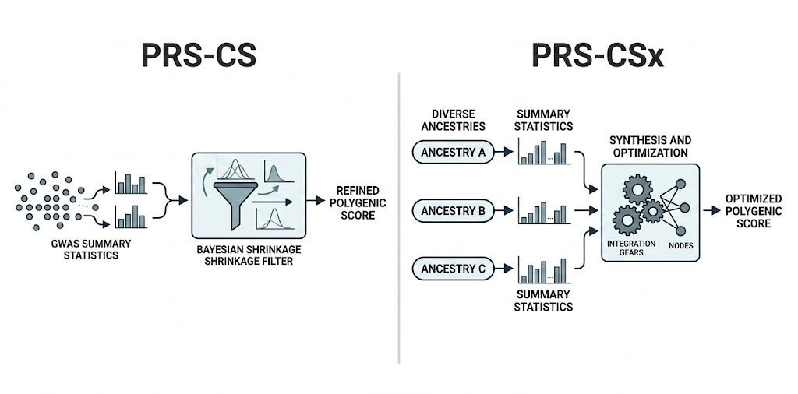

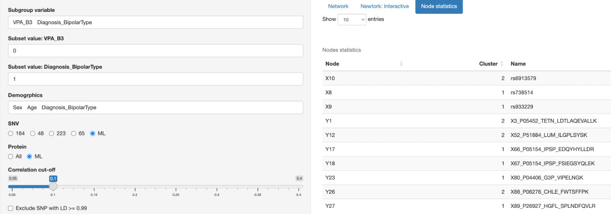{.case-img-2}
:::
::::
::::::

## Case 2. 소아 아토피성 염증 피부 지질체-전사체 통합 분석

:::::: {.columns .case-slide}
:::: {.column width="48%"}
::: {.case-media .case-media-full data-caption="PCA, heatmap, volcano, GO/KEGG Enrichment Analysis"}
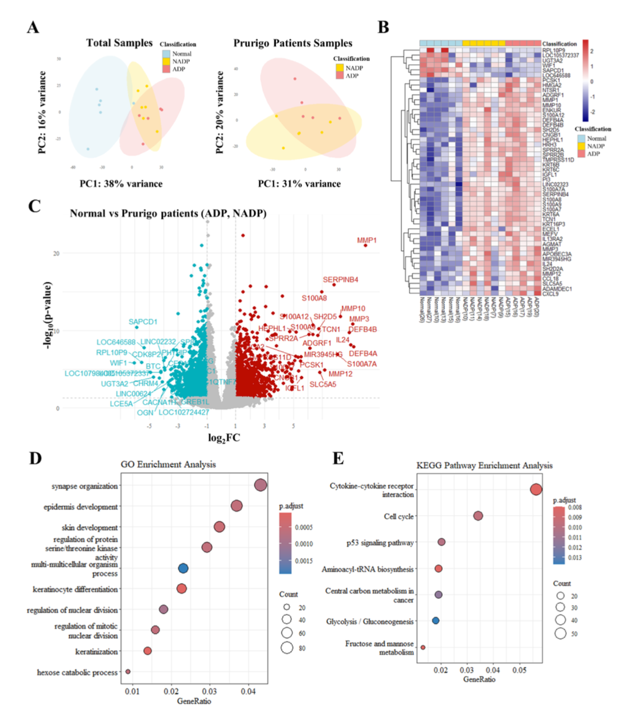{.case-img-1}
:::
::::

::: {.column width="52%"}
[강남성심병원 피부과 김혜원 교수님]{.case-owner}

**분석 데이터**

-   소아 아토피 피부 lipidomics, 부위 A/B/C 정보와 임상 중증도 지표가 함께 정리된 site-specific 통합 자료.
-   이후 sensitive skin, prurigo 데이터셋으로 확장, 질환별 차이와 공통 lipid 패턴을 비교 가능한 프레임으로 구성.

**분석 목표 및 통계 분석**

-   염증 반응과 연결되는 lipid axis 탐색 후, 부위별 변화와 질환 간 공통 signature 도출을 위한 다층 비교 설계.
-   [fold-change]{.stat-tech}와 [limma + empirical Bayes]{.stat-tech} 기반 차이 검정을 우선 수행하고, [BH-FDR]{.stat-tech}, [Spearman correlation]{.stat-tech}, [PCA/UMAP]{.stat-tech}로 신호를 단계적으로 정리.

**결과 및 산출물**

-   부위별 lipid fold-change 요약표와 발표용 Figure 세트를 정리하고, 3질환 통합 자료에서는 unique lipid 248개 중 18개 공통 species 확인으로 질환 간 공통 축 제시.
:::
::::::

## Case 2. 소아 아토피성 염증 피부 지질체-전사체 통합 분석

:::::: {.columns .case-slide}
:::: {.column width="48%"}
::: {.case-media .case-media-2 data-caption="상:Total samples 분류 및 ADP volcano plot, 하: Lipid-Gene Interaction Network"}
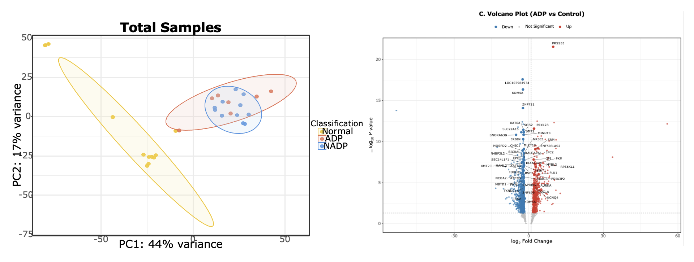{.case-img-2}

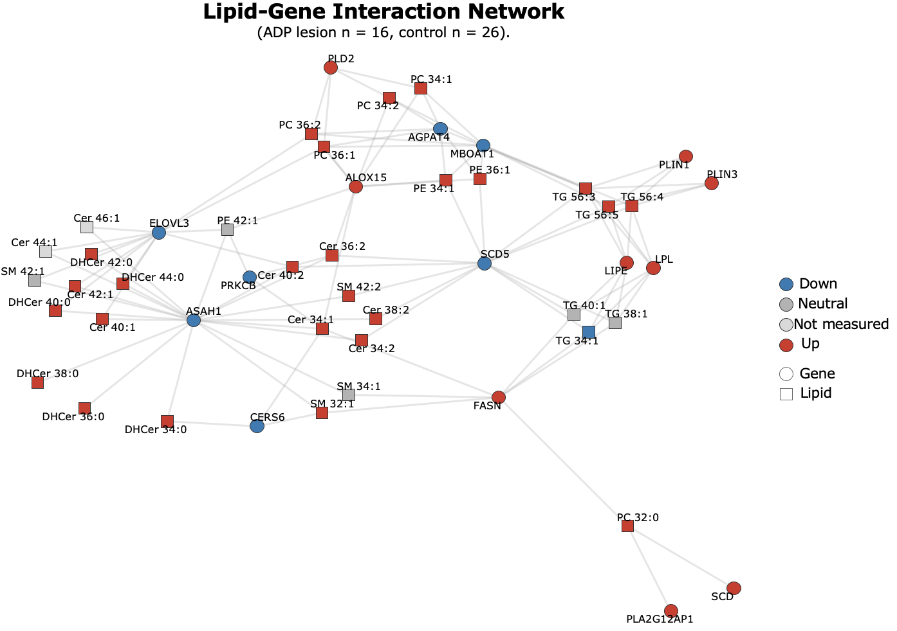{.case-img-2}
:::
::::

::: {.column width="52%"}
[강남성심병원 피부과 김혜원 교수님]{.case-owner}

**분석 데이터**

-   transcriptome 29샘플, lipid-matched subset, 염증·섬유화 후보 유전자 세트를 함께 묶은 multiomics 확장 자료.
-   피부 표면 lipid 변화와 전사체 수준 염증 경로를 직접 연결해 볼 수 있도록 구성한 matched analysis 자료.

**분석 목표 및 통계 분석**

-   lipidomics에서 관찰된 변화축을 transcriptome과 연결한 뒤, 염증·장벽 관련 후보 pathway 재정렬을 통한 multiomics 근거 보강.
-   [DESeq2]{.stat-tech} 기반 DEG 산출 후 [VST PCA]{.stat-tech}, [GO/KEGG enrichment]{.stat-tech}, [BH-corrected correlation]{.stat-tech}을 통한 lipid-gene 연결축 재평가.

**결과 및 산출물**

-   논문용 Figure 1\~5 세트와 multiomics correlation 패널을 정리하고, `LAD vs Healthy` 비교에서는 `[FDR \< 0.05]` 유전자 3개 확인 및 후속 검증 후보군 압축.
:::
::::::

## Case 3. STING1-lysosome 발현량 난소암 환자 생존 분석

:::::: {.columns .case-slide}
::: {.column width="52%"}
[일산백병원 진단검사의학과 김지예 교수님]{.case-owner}

**분석 데이터**

-   내부 GeoMx spatial transcriptomics와 외부 TCGA/GTEx 난소암 자료를 함께 사용한 생존·분자 통합 자료.
-   단일 유전자 비교를 넘어, STING1-lysosome 관련 245개 유전자 모듈까지 확장 가능한 구조라는 점이 핵심 특징.

**분석 목표 및 통계 분석**

-   STING1-lysosome 축의 예후 연관성 탐색 후, 모듈 수준 재배선과 외부 코호트 검증을 통한 기능 후보 도출 목적의 분석 설계.
-   [Kaplan-Meier]{.stat-tech}, [Cox]{.stat-tech}로 예후 신호를 점검한 뒤, [DESeq2]{.stat-tech}, [GO/KEGG/PPI]{.stat-tech}, [eigengene correlation]{.stat-tech}, [paired Wilcoxon]{.stat-tech}으로 모듈 수준 해석을 확장.

**결과 및 산출물**

-   생존곡선, volcano, module network, eigengene correlation 구축, PFS는 event 부족으로 제한하여 OS 중심 해석과 외부 후보유전자 검증 축 명확히 정리.
:::

:::: {.column width="48%"}
::: {.case-media .case-media-2 data-caption="상: 누적발생/KM 곡선 예시. 하: TCGA 기반 volcano와 gene-correlation heatmap."}
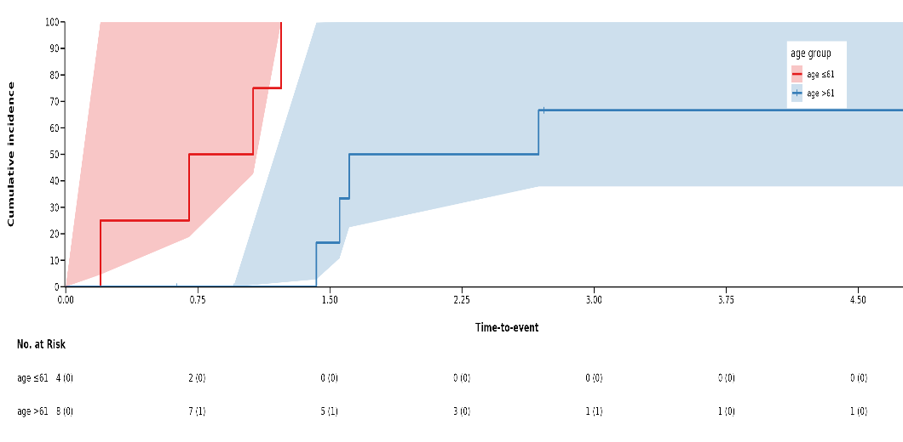{.case-img-2}

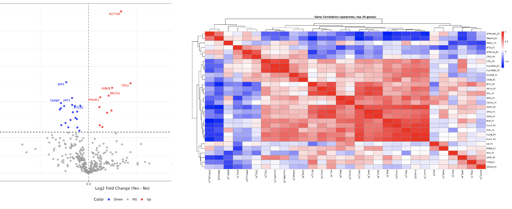{.case-img-2}
:::
::::
::::::

## Case 4. COPD 환자 사망 연관 SNP 탐색을 위한 GWAS 분석

:::::: {.columns .case-slide}
:::: {.column width="48%"}
::: {.case-media .case-media-2 data-caption="상: Manhattan Plot: Pure COPD nocovar, 하: GWAS QQplot, Forest Plot(n=8)"}
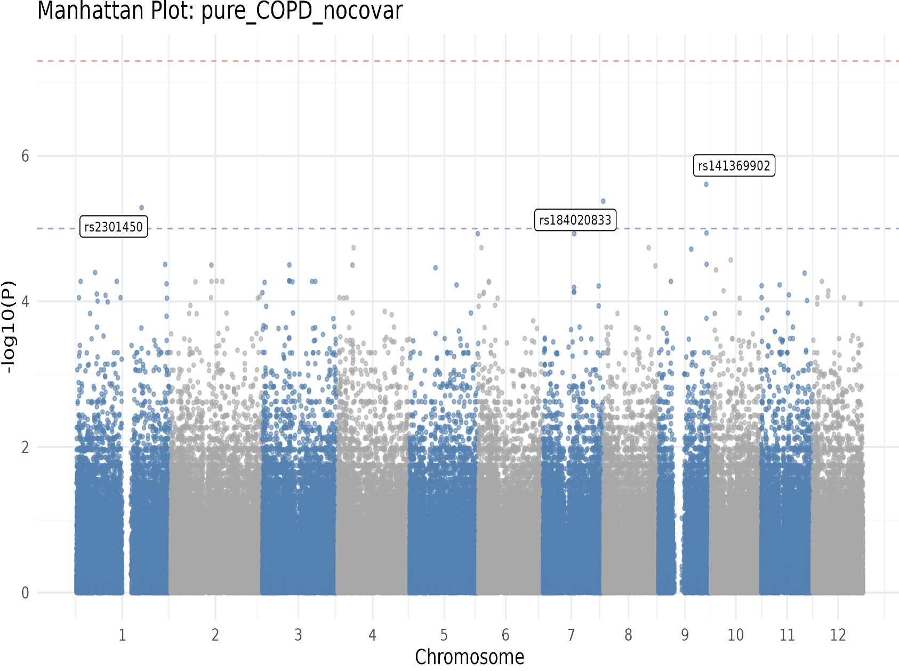

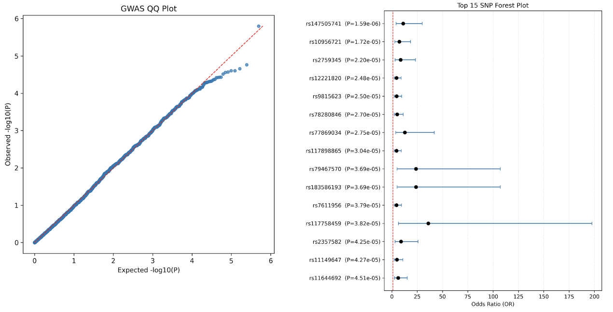
:::
::::

::: {.column width="52%"}
[동탄성심병원 호흡기내과 송진화 교수님]{.case-owner}

**분석 데이터**

-   KOCOSS COPD 코호트 중 SNP 데이터가 있는 환자 대상, 임상 기본정보와 mortality outcome을 통합한 유전연관 분석 자료.
-   전체 코호트뿐 아니라 `pure_COPD`, `TB_COPD`, `Asthma_COPD`, `BE_COPD` phenotype별 하위군을 나눠 subtype-specific signal 탐색.

**분석 목표 및 통계 분석**

-   COPD 환자의 mortality 연관 유전변이를 탐색, 임상 phenotype에 따른 신호 변경 탐색을 위한 subtype-specific GWAS 설계.
-   [Table 1]{.stat-tech}와 결측률 점검, [PLINK logistic GWAS]{.stat-tech}를 `pure_COPD`, `TB_COPD`, `Asthma_COPD`, `BE_COPD` 하위군별 반복 수행, [covariate-adjusted model]{.stat-tech}을 통해 age, sex, BMI, baseline FEV1 보정 결과 통합 비교.

**결과 및 산출물**

-   phenotype별 baseline 특성표, 보정 전후 GWAS, top SNP 요약표 정리 및 하위군별 signal 비교를 위한 Manhattan plot 도출.
-   COPD 아형별 mortality-associated SNP 후보를 분리 후 해석 가능 구조를 확립, 후속 replication 또는 기능 해석을 위한 lead SNP 정리.
:::
::::::

## Case 5. 방광암 및 폐암 진단 바이오마커 모델

:::::: {.columns .case-slide}
::: {.column width="52%"}
[시선바이오머티리얼즈 연구팀]{.case-owner}

**분석 데이터**

-   방광암 methylation marker 자료와 폐암 MPR panel, 외부검증용 test set을 함께 사용한 멀티오믹스 데이터.
-   원 marker 값뿐 아니라 control 기준 percentile feature를 추가 생성.

**분석 목표 및 통계 분석**

-   적용 가능한 diagnostic marker 조합 탐색 후, 설명 가능한 기준값과 배포형 예측 도구까지 연결하기 위한 모델링 설계.
-   [ROC/AUC]{.stat-tech}, [logistic regression]{.stat-tech}으로 기본 성능을 확인 및 [percentile thresholding]{.stat-tech}, [10-fold CV]{.stat-tech}, [LASSO]{.stat-tech}, [Random Forest]{.stat-tech} 결합, 후보 모델 압축.

**결과 및 산출물**

-   ROC 패널, cutoff 기반 모델, 배포형 예측 앱 연결, AUC와 best-threshold, sensitivity/specificity, PPV/NPV, `95% sensitivity 기준 specificity` 제시.
:::

:::: {.column width="48%"}
::: {.case-media .case-media-2 data-caption="상: 통합 진단모델 ROC와 AUC. 하: marker distribution boxplot과 pairwise p-value."}
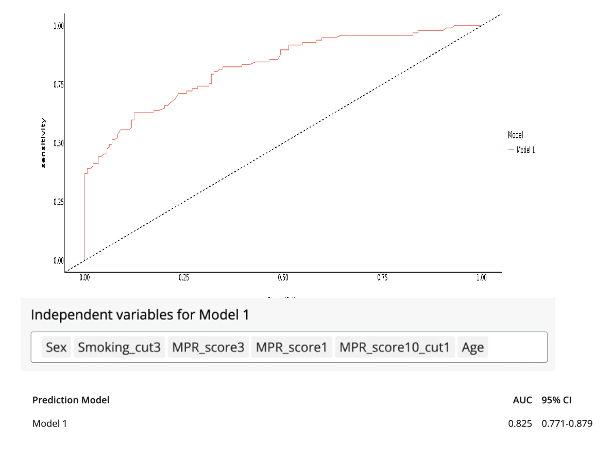{.case-img-2}

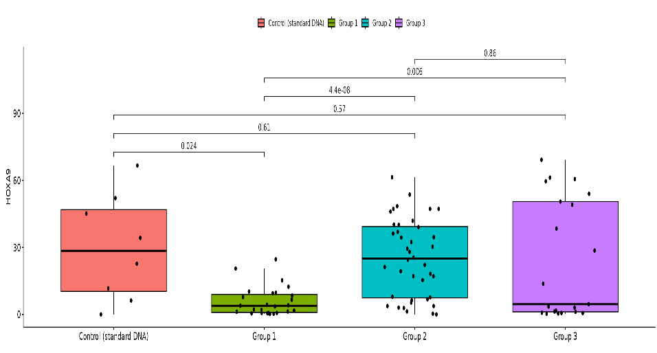{.case-img-2}
:::
::::
::::::

## Case 6. 직장암 수술전 항암방사선용법 반응 유전자 분석

:::::: {.columns .case-slide}
:::: {.column width="48%"}
::: {.case-media .case-media-2 data-caption="상: IC_GR_vs_PR 대표 heatmap. 하: DFS Kaplan-Meier와 TC vs IC volcano."}
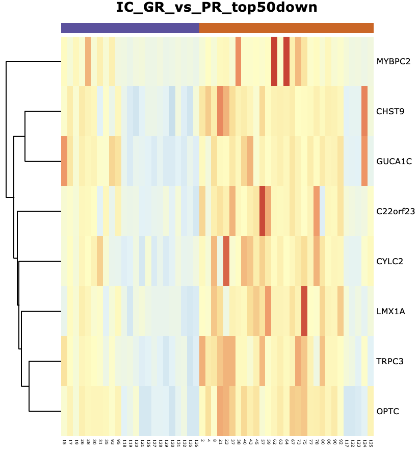{.case-img-2 width="796" height="325"}

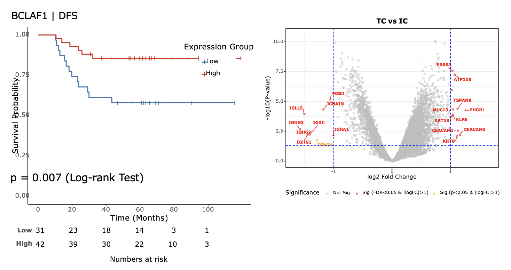{.case-img-2 width="794"}
:::
::::

::: {.column width="52%"}
[동탄성심병원 신은 교수님]{.case-owner}

**분석 데이터**

-   직장암 CCRT 반응군의 TC/IC spatial transcriptomics와 외부 검증 코호트 통합 데이터셋.
-   반응군과 생존 변수를 초기 단계에서 함께 정의하여, discovery와 validation 진행.

**분석 목표 및 통계 분석**

-   반응군 차이를 설명하는 DEG 선별 후, 생존 및 외부 코호트 예측 가능성까지 이어지는 후보유전자 축 도출 목표의 설계.
-   반응군 정의 후 [limma + eBayes]{.stat-tech} 기반 DEG 분석, [heatmap/volcano]{.stat-tech} 시각화, [maxstat + Kaplan-Meier]{.stat-tech}, [ROC/Youden]{.stat-tech} 순 확장.

**결과 및 산출물**

-   DEG 통합표와 생존·검증 Figure를 한 세트로 정리하고, 생존 관련 결과는 69행(유니크 61유전자), 외부 binary validation 결과는 타깃별 1,071행 규모로 저장되어 후속 선별.
:::
::::::

## Case 7. 피부 장벽 및 혈관 반응과 피부 표면 지질체 상관 분석

:::::: {.columns .case-slide}
::: {.column width="52%"}
[강남성심병원 피부과 박진서 교수님]{.case-owner}

**분석 데이터**

-   민감피부 환자군과 대조군의 TEWL, SCH, erythema, porphyrin, SS-10, lipid species를 함께 측정한 통합 자료.
-   표본 수 대비 변수 수가 큰 high-dimensional 구조로, 단일 p-value보다 패턴 탐색과 후보 압축이 중요한 데이터셋.

**분석 목표 및 통계 분석**

-   피부 장벽·혈관 반응 지표와 lipid pattern 사이의 연결 구조 탐색 후, symptom domain별 후보 지질 축 도출을 위한 exploratory 분석 설계.
-   [Spearman correlation]{.stat-tech}과 [linear regression]{.stat-tech}으로 1차 후보를 점검한 뒤, [PCA]{.stat-tech}, [PLS-DA]{.stat-tech}, [PERMANOVA]{.stat-tech}, [network analysis]{.stat-tech}, [LASSO]{.stat-tech}로 탐색 신호를 압축.

**결과 및 산출물**

-   correlation heatmap과 symptom-lipid network를 구축하고, SS-10 item 대 112개 lipid 상관에서는 `FDR q \< 0.05`통과 lipid 부재, patient-control PLS-DA의 `PERMANOVA P = 0.753, R² = 0.007` exploratory layer 중심 해석 정리.
:::

:::: {.column width="48%"}
::: {.case-media .case-media-2 data-caption="상: erythema·porphyrin vs lipid Spearman heatmap. 하: patient-control PLS-DA와 symptom-lipid network."}
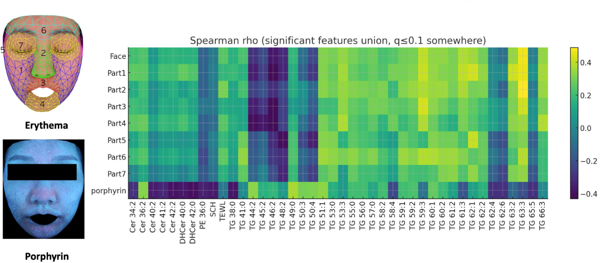{.case-img-2}

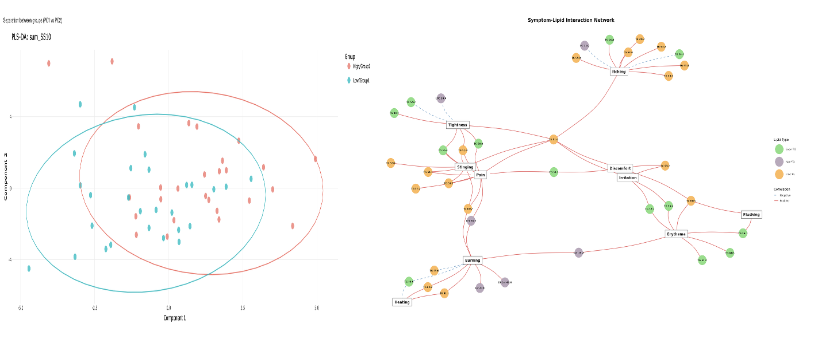{.case-img-2}
:::
::::
::::::

## Case 8. qPCR miRNA 기반 폐암 진단 모델 연구

:::::: {.columns .case-slide}
:::: {.column width="48%"}
::: {.case-media .case-media-2 data-caption="상: 후보 signal regional plot과 miRNA ROC 비교. 하: stage group별 miRNA fold-change boxplot."}
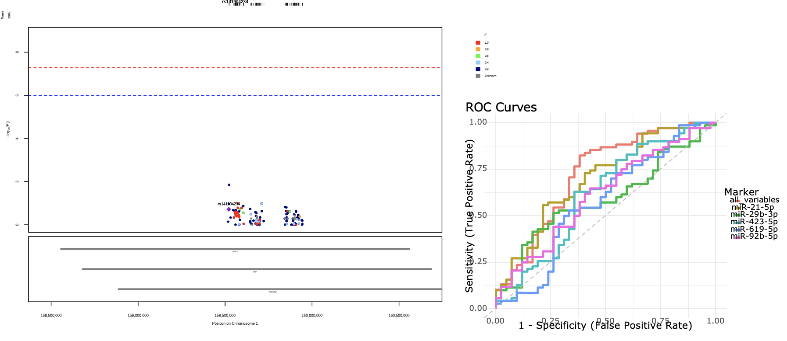{.case-img-2}

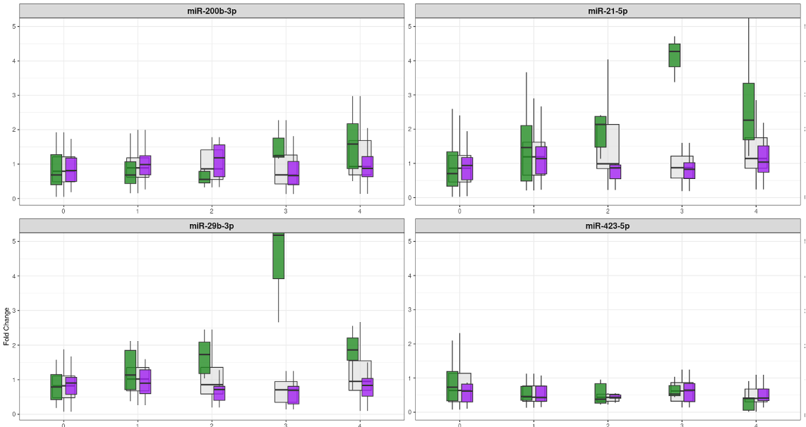{.case-img-2}
:::
::::

::: {.column width="52%"}
[건국대병원 호흡기내과 이계영 교수님]{.case-owner}

**분석 데이터**

-   qPCR miRNA, 연령, 흡연력, 병기, 실험 라운드 정보를 포함한 멀티오믹스 폐암 진단 자료.
-   라운드 차이와 샘플 정합화 이력이 함께 남아 있어, marker 성능 비교와 데이터 정제 이슈를 동시에 다룰 필요성.

**분석 목표 및 통계 분석**

-   단일 miRNA 유의성과 다중 marker panel 성능을 분리 평가한 뒤, 임상변수 보정 모델까지 확장하여 screening용 조합 후보 압축 설계.
-   qPCR 정규화 후 [Table 1]{.stat-tech}, [boxplot + pairwise test]{.stat-tech}, [logistic ROC/AUC]{.stat-tech}, [UpSet combination search]{.stat-tech}, [LASSO]{.stat-tech}, [Random Forest]{.stat-tech} 순으로 비교 평가 진행.

**결과 및 산출물**

-   8개 후보 miRNA에서 3·4·5-marker 조합까지 비교하는 ROC Figure와 발표용 PPT·웹앱으로 연결하고, 최종 AUC·민감도·특이도는 raw qPCR/pins 자료 기준 재계산.
:::
::::::

## Case 9. 공단·심평원 빅데이터 분석

::: spacer-xs
:::

::::::::::::::::: nhis-hira-slide
:::::: nhis-intro-box
::::: nhis-intro-layout
::: nhis-logo-stack


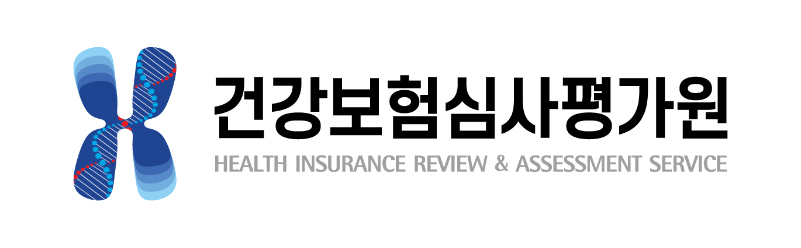
:::

::: nhis-intro-text
**대한민국 공단(NHIS/NHID)·심평원(HIRA) 빅데이터**는 전 국민 단위의 건강검진, 소득, 사망, 데이터를 포함한 종단형 인프라입니다.\
최근 5년간 `Diabetes Care`, `International Journal of Epidemiology`, `JAMA Network Open`, `JAMA Pediatrics` 등에 NHIS/HIRA 기반 연구가 지속적으로 게재되고 있으며, **임상코호트와 유전체·오믹스 자료를 결합한 고품질 멀티오믹스 연구**로 확장하기 적합합니다.
:::
:::::
::::::

**공단/심평원 데이터 활용 및 분석 사례**

:::::::::::: nhis-case-grid
::::: nhis-case-card
[사례 1]{.nhis-case-card-title}

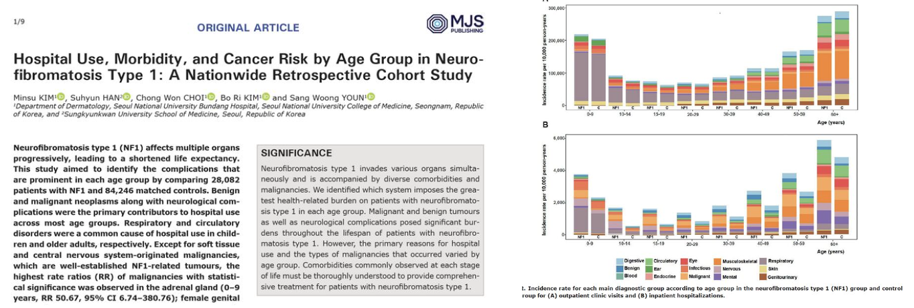

::: nhis-case-meta
분당서울대병원 피부과 김보리 교수님
:::

제1형 신경섬유종증 환자의 연령대에 따른 주요 합병증 발생 변화 연구

::: nhis-case-journal
*Acta Dermato-Venereologica* (IF 4.3) 게재
:::
:::::

::::: nhis-case-card
[사례 2]{.nhis-case-card-title}

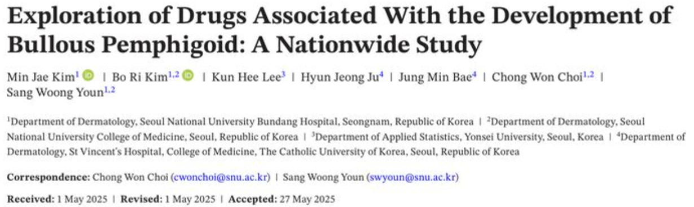

::: nhis-case-meta
분당서울대병원 피부과 김보리 교수님
:::

수포성 천포창(Bullous Pemphigoid, BP)의 발생과 연관된 위험 약물 규명

::: nhis-case-journal
*The Journal of Dermatology* (IF 2.7) 게재
:::
:::::

::::: nhis-case-card
[사례 3]{.nhis-case-card-title}

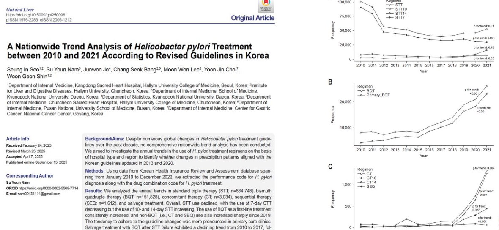

::: nhis-case-meta
강동성심병원 소화기내과 서승인 교수님
:::

H. pylori 제균치료의 실제 처방 경향의 전국적 조사

::: nhis-case-journal
*Gut and Liver* (IF 3.2) 게재
:::
:::::
::::::::::::
:::::::::::::::::

## Case 9. 공단·심평원 데이터 활용 멀티오믹스 분석 사례

:::::::::::: {.columns .nhis-overview-slide}
::: {.column width="26%"}
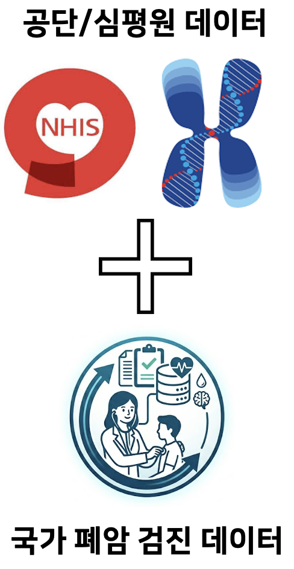{.nhis-bordered-image width="380"}
:::

:::::::::: {.column width="73%"}
::::::::: nhis-overview-right
**서울대학교병원 영상의학과 김형진 교수님**

:::::::: nhis-overview-grid
:::: nhis-case-card
[사례 1]{.nhis-case-card-title} 국가폐암검진에서 발견된 위양성 결과와 사후 관리가 향후 폐암 발생률과 사망률에 미치는 영향 분석

::: nhis-case-journal
*Journal of Internal Medicine* (IF 9.2) 게재
:::

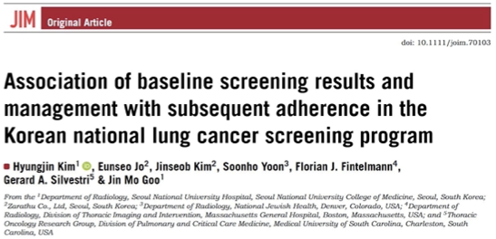{.nhis-case-image-compact}

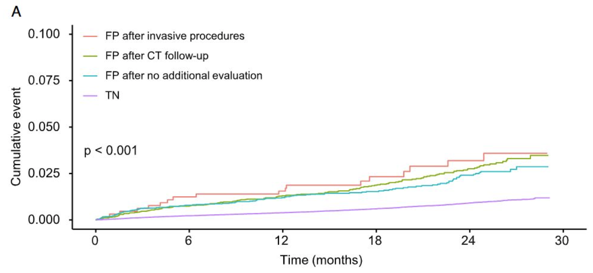{.nhis-case-image-compact}

[전체 표본 수 [235,753명]{.nhis-sample-size-number} 대상(2019 ~ 2021)]{.nhis-sample-size}

::::

::::: nhis-case-stack
:::: nhis-case-card
[사례 2]{.nhis-case-card-title} 국가폐암검진에서 발견된 간질성 폐 이상(ILA, Intersitial Lung Abnormalities)의 예후적 가치 분석

::: nhis-case-journal
*The Journal of Dermatology* (IF 2.7) 게재
:::

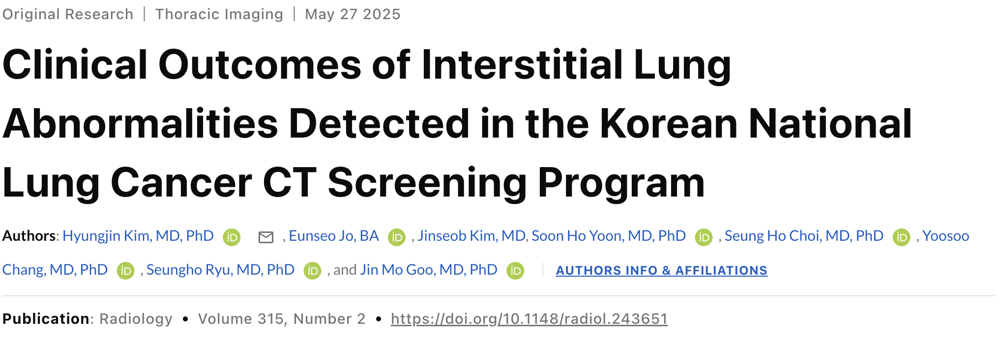{.nhis-case-image-compact}

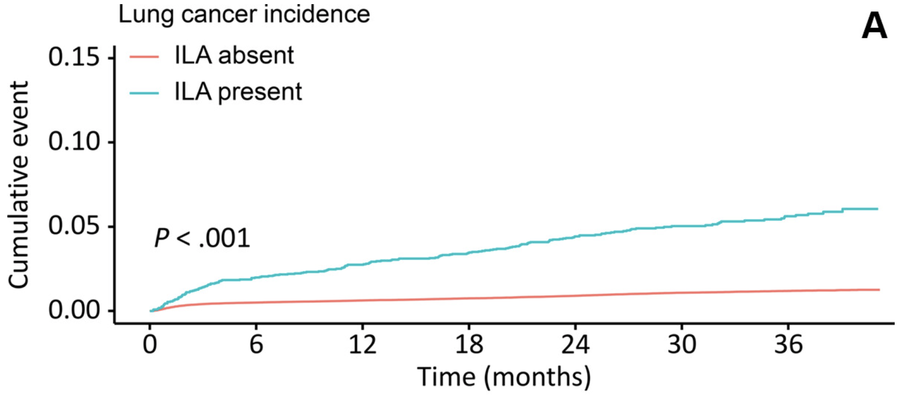{.nhis-case-image-compact}

[전체 표본 수 [125,600명]{.nhis-sample-size-number} 대상(2019 ~ 2020)]{.nhis-sample-size}

::::
:::::
::::::::

:::::::::
::: {.nhis-inline-badge-row}
[국가폐암검진 CT 판독 데이터]{.nhis-inline-badge .nhis-inline-badge-blue}와 [건강보험공단 국민 데이터]{.nhis-inline-badge .nhis-inline-badge-orange}을 결합한 [복합적 의료 분석 사례]{.nhis-inline-badge-emphasis} [ (기본 소득, 처방 및 확진, 생존여부 등) ]{.nhis-inline-badge-subtext}
:::
::::::::::
::::::::::::

## 분석 웹앱 제공 — jsmodule 기반 Shiny

::: spacer-xs
:::

::::: columns
::: {.column width="50%"}

:::

::: {.column width="50%"}

:::
:::::

## 분석 웹앱 (계속)

::::: columns
::: {.column width="50%"}

:::

::: {.column width="50%"}

:::
:::::

::: accent-box-emerald
**jsmodule 모듈** — tb1module2, logisticModule2, coxModule, kaplanModule, **subgroupModule**, rocModule, **timerocModule**, ggpairsModule2, jsPropensityGadget. 오믹스 프로젝트마다 **연구자 전용 앱** 동시 제공
:::

## 뇌졸중 연구에 바로 적용 가능한 분석 전략

::: spacer-xs
:::

::::::::: columns
::::: {.column width="50%"}
::: highlight-box
**① Stroke subtype GWAS**

-   TOAST 아형 × genotyping array QC
-   1000G EAS imputation, regenie
-   GIGASTROKE · STROMICS 메타분석 연계
-   Manhattan / QQ Shiny 탐색
:::

::: highlight-box-blue
**② 약물유전체 (Clopidogrel·Statin·NOAC)**

-   **CYP2C19 star allele** 자동 판정 (PharmVar)
-   SLCO1B1 · ABCG2 statin PK
-   CPIC level 1A 변이 패널 도출
-   변이 × PGS interaction 모델
:::
:::::

::::: {.column width="50%"}
::: highlight-box-teal
**③ 다층 통합 (MOFA · MR)**

-   scRNA-seq × Olink × genotyping MOFA
-   Mendelian randomization (IVW, Egger)
-   pQTL/eQTL → druggable target 필터
:::

::: highlight-box-purple
**④ HIRA 연계 예후 모델**

-   처방 지속도 / 재입원 / 출혈 코드 추출
-   IPTW · time-varying Cox (tmerge)
-   Forestploter 서브그룹 plot
-   재발·출혈·사망 통합 예측 모델
:::
:::::
:::::::::

## 마무리 — 차라투가 함께할 수 있는 것

::: spacer-xs
:::

::: accent-box
**멀티오믹스는 "분석 기법의 나열"이 아니라, 임상 질문에서 출발해 재현 가능한 파이프라인·인과 검증·임상 적용까지 잇는 과정입니다. 차라투는 7년간 이 전 과정을 수십 개 프로젝트에서 실행해 왔습니다**
:::

::::: columns
::: {.column width="50%"}
[**제안 협력 형태**]{.section-title}

-   **과제 기반 계약** — 특정 연구 단위 (GWAS, scRNA-seq 등)
-   **연단위 계약** — 연구실 상시 분석 지원
-   **기술 자문** — 설계·분석 파이프라인 리뷰
-   **공동 저자 참여** — 분석가 SCI 공저 포함
:::

::: {.column width="50%"}
[**제공 산출물 표준**]{.section-title}

-   원본·정제 데이터 중앙 관리
-   전체 분석 R 스크립트 (Git)
-   연구자 전용 Shiny 앱
-   논문용 표·그림(flextable / rvg PPT)
-   커뮤니티 상시 피드백
:::
:::::

::: accent-box-emerald
**연락처** — office\@zarathu.com \| +82 70-7954-3712 \| [community.zarathu.com](https://community.zarathu.com) \| [openstat.ai](https://openstat.ai)
:::

##  {background-color="#2A3D21"}

::::: {style="text-align: center; padding-top: 180px;"}
<h1 style="color: #ffffff; font-size: 2.0em; border: none; border-image: none;">

연구자 옆에는 차라투

</h1>

::: {style="margin-top: 40px;"}

:::

::: {style="color: #C8E6C9; font-size: 0.7em; margin-top: 60px; line-height: 2;"}
<strong>Contact</strong><br> office\@zarathu.com  \|  +82 70-7954-3712<br> <a href="https://www.zarathu.com" style="color: #C8E6C9;">https://www.zarathu.com</a>
:::
:::::
