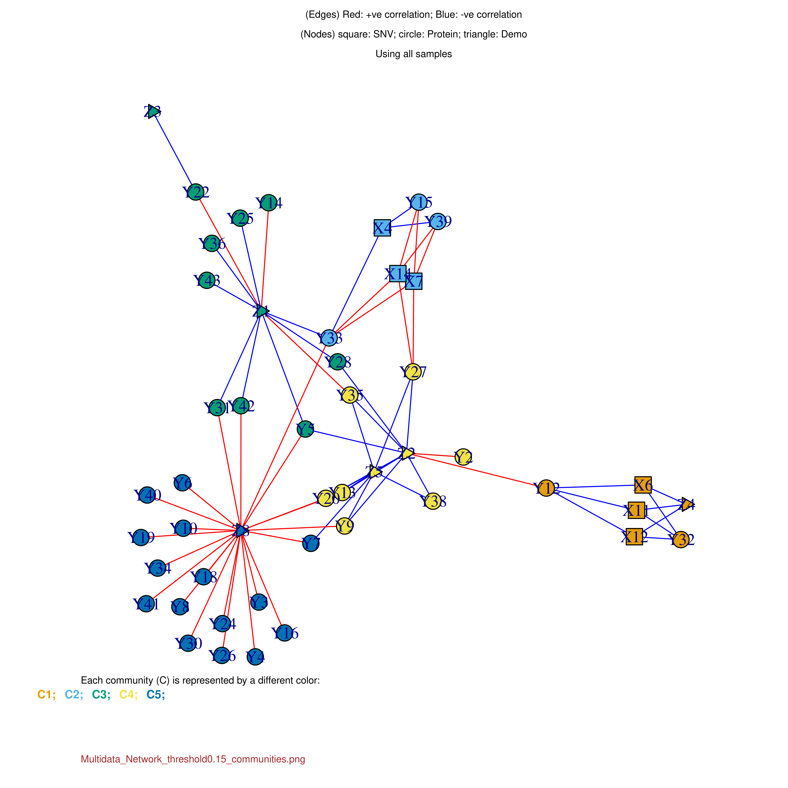
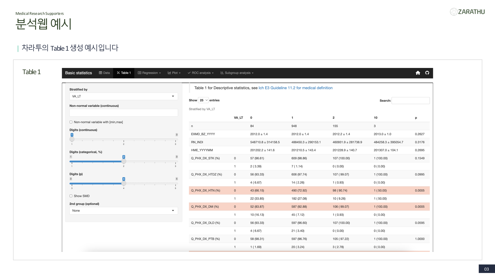
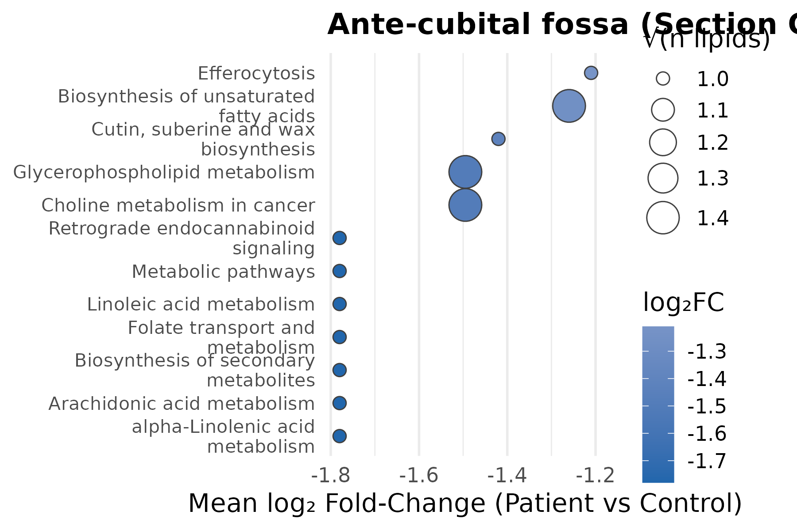
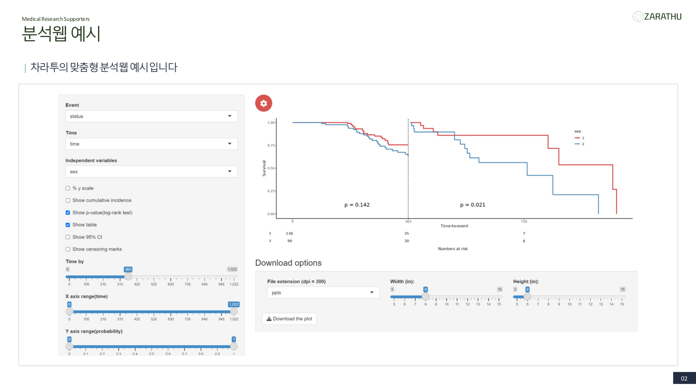
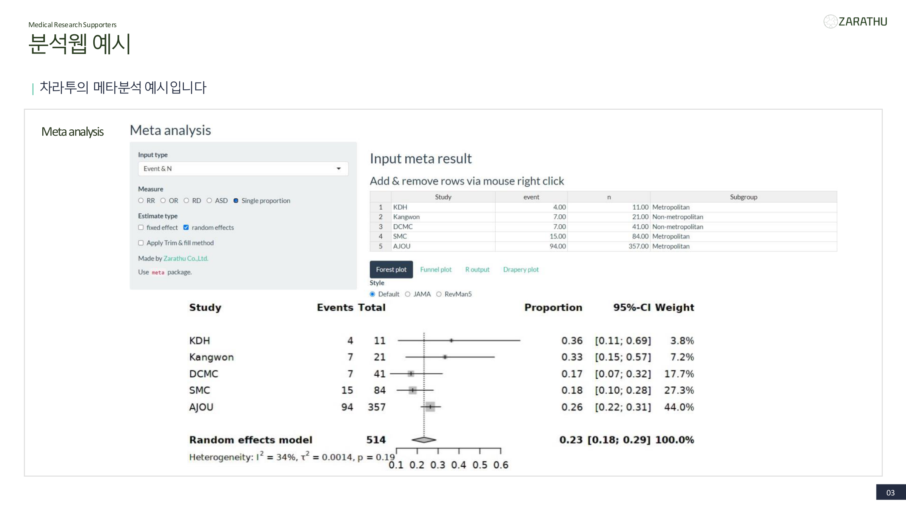
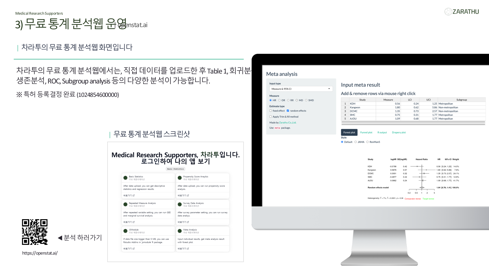

## 목차

::: {style="padding: 10px 40px;"}

::: {.highlight-box}
**I. 차라투 소개** — 누가, 무엇을 하는 회사인가
:::

::: {.highlight-box-blue}
**II. 차라투가 수행한 멀티오믹스 분석** — 암·정신과·피부·호흡기 7개 사례
:::

::: {.highlight-box-teal}
**III. 공단·심평원 데이터 연계** — 200만명 규모 연구 경험
:::

::: {.highlight-box-purple}
**IV. 뇌졸중 연구 협업 제안** — 바로 적용 가능한 분석 전략
:::

:::

## 차라투 주식회사

::: {.spacer-xs}
:::

::: {.accent-box}
국내 유일 **의학연구지원 전문기업**. 대표 **예방의학 전문의 · 수학올림피아드 특기자** 출신으로 임상·유전체·오믹스 분석 전 영역을 아우릅니다
:::

:::: {.columns}
::: {.column width="55%"}

[**수행 범위**]{.section-title}

- 연구 설계·샘플수 계산부터 논문 투고까지 **end-to-end**
- 12시간 내 응답 보장, **200편+ SCI 논문** 지원
- 한림대·인제대·삼성서울병원 등 다수 기관 연단위 계약

[**오믹스 수행 경험**]{.section-title}

- GWAS, PRS (PRScs · PRScsx), scRNA-seq
- Nanostring spatial transcriptomics
- Proteomics · lipidomics · methylation
- xMWAS 기반 다층 네트워크 통합

:::
::: {.column width="45%"}

::: {.summary-grid}
::: {.summary-item .si-green}
**22만+**

R 패키지 다운로드
:::
::: {.summary-item .si-blue}
**200+**

SCI 논문 지원
:::
::: {.summary-item .si-teal}
**8건**

국가 R&D 수행
:::
:::

::: {.spacer-sm}
:::

::: {.accent-box-emerald}
**팀 구성** — 정규직 5명 + 인턴 7명 (의학·통계·개발 전문인력)
:::

:::
::::

## 왜 멀티오믹스인가 — 단일 오믹스의 한계

::: {.spacer-xs}
:::

:::: {.columns}
::: {.column width="52%"}

[**한계**]{.section-title}

- GWAS는 표현형 변이의 **2~8%만 설명**
- 단일 유전자(CYP2C19) 변이는 약물 반응의 **~12%만 설명**
- 정적 '상태(state)' 관찰 → 동적 '과정(process)' 규명 필요

[**통합이 필요한 이유**]{.section-title}

- **인과성** 규명 — MR, pQTL/eQTL
- **약물 반응 이질성** — 동일 변이 내 반응성 차이
- **치료 표적** 도출 — 단백체·대사체 수준

:::
::: {.column width="48%"}

::: {.accent-box-emerald}
**오믹스 계층** (DNA → RNA → Protein → Metabolite)

- **Genomics / Epigenomics**
- **Transcriptomics** — scRNA-seq, spatial
- **Proteomics** — Olink PEA
- **Metabolomics / Lipidomics**
:::

::: {.highlight-box-purple}
**통합 기법** — MOFA · xMWAS · Mendelian Randomization · QTL · EWAS
:::

:::
::::

## 분석 전략 5단계 프로세스

::: {.spacer-sm}
:::

STEP 1
QC &amp; Imputation
Genotyping call, 1000G/KGP imputation, batch effect, normalization

▶

STEP 2
단일 오믹스 분석
GWAS, EWAS, DEG/limma, DE 단백, VIP/OPLS-DA

▶

STEP 3
PRS / 유전적 부담
PRS Catalog, PRScs, PRScsx (다인종), GIGASTROKE iPGS

▶

STEP 4
다층 통합
MOFA, xMWAS network, variant × PGS × imaging interaction

▶

STEP 5
인과성 &amp; 예후 모델
Mendelian randomization, Cox, 웹 기반 Shiny 대시보드

::: {.spacer-sm}
:::

::: {.accent-box}
**차라투 차별점** — 각 단계의 스크립트·데이터·결과물을 **연구자 전용 커뮤니티 게시판**으로 관리하여, 연구 종료 후에도 추가 요청 즉시 대응
:::

## Case 1. 양극성장애 약물반응 — 유전체·단백체·임상 통합

::: {.spacer-xs}
:::

:::: {.columns}
::: {.column width="55%"}

**삼성서울병원 정신건강의학과 백지현 교수 (BOMICS)**

::: {.section-title}
연구 설계
:::

- Lithium · Valproate **치료 반응**이 outcome
- **KChip 유전체** + 혈청 **단백체 43종** (APOC1, CRP 등) + **임상 표현형** (CSM, PAI, ASRS, WURS)
- T0/T1/T2 **시계열 단백체** → ΔT1, ΔT2 파생변수화

::: {.section-title}
분석
:::

- SNP annotation + Plink LD → ML 변수 선택
- **xMWAS 네트워크** — 유전형·단백체·반응 community
- Shiny 앱으로 환자 개별 조회 지원

:::
::: {.column width="45%"}

{width="100%" height="420px" fig-align="center"}

::: {.highlight-box-purple}
**체감 난이도 상** — 유전형 × 단백체 × 반응의 **삼중 시계열** 구조
:::

:::
::::

## Case 2. PRScs / PRScsx — 조현병·우울증 다인종 PRS

::: {.spacer-xs}
:::

:::: {.columns}
::: {.column width="50%"}

**삼성서울병원 백지현 교수 — PRS_Schizo_MDD, PRS_QOL**

::: {.section-title}
수행 내용
:::

- **PGC/GWAS Catalog summary data** 큐레이션
- **PRScs** (Bayesian) — single ancestry
- **PRScsx** — 다인종(EAS + EUR) 검정력 보정
- 1000G EAS imputation → 개인별 PRS
- PRS × 임상 → **치료 순응도·QOL** 연관

:::
::: {.column width="50%"}

::: {.accent-box-emerald}
**PRS 구축 단계**

1. GWAS summary curation
2. LD reference panel
3. PRScs/csx posterior effect size
4. Target genotype 적용
5. PRS × outcome 모델링
:::

::: {.highlight-box}
뇌졸중 연구에 바로 이식 — **GIGASTROKE iPGS**, 출혈 위험 PGS, CYP2C19 × PRS **다층 모델**
:::

:::
::::

## Case 3. 폐암·방광암 단백 마커 — 진단 모델 개발

::: {.spacer-xs}
:::

:::: {.columns}
::: {.column width="55%"}

**시선바이오머티리얼즈 — 방광암/폐암 biomarker panel**

::: {.section-title}
분석 설계
:::

- 1차~4차 **혈청 단백 마커 패널** (Normal vs Cancer vs Control)
- `caret` 기반 ML — LASSO, RF, XGBoost, ElasticNet 비교
- **AUC + PPV/NPV + F1** 동시 최적화
- 1차 개발셋 → 2~4차 **외부 검증**
- 임상 공변량 보정 + marker-only 비교
- Youden index cutoff, SHAP importance 도출

:::
::: {.column width="45%"}

{width="100%" height="380px" fig-align="center"}

::: {.highlight-box-blue}
**뇌졸중 Olink 단백체 분석에 이식 가능** — 고차원 변수 선택, CV schema, 외부 검증 설계
:::

:::
::::

## Case 4. 직장암 CCRT 반응 — Spatial Transcriptomics

::: {.spacer-xs}
:::

:::: {.columns}
::: {.column width="55%"}

**동탄성심 신은 교수 — Nanostring spatial gene expression**

::: {.section-title}
데이터 구조
:::

- 18,677 유전자 × 136 샘플
- **TC** (CK+ 종양) / **IC** (CD45+ 면역) segmentation
- 반응군 TR(25) / GR(50) / PR(61) 3단계 층화

::: {.section-title}
분석 흐름
:::

- `limma` 기반 **DEG** (FDR < 0.05, |log2FC| > 1)
- TC vs IC 종양-면역 상호작용
- KEGG / Reactome / Hallmark enrichment
- RRM2 × PD1 상관, Top50 외부 검증

:::
::: {.column width="45%"}

::: {.accent-box-emerald}
**scRNA-seq nested design 분석에 이식 가능**

- Extreme phenotype 선별
- Cell-type 특이적 DEG
- **회복 특이 면역세포 지도**
:::

::: {.highlight-box-teal}
**데이터 관리** — 원본·정제·Shiny 앱까지 연구자가 언제든 재분석 가능한 구조로 제공
:::

:::
::::

## Case 5. 피부 지질체학·전사체 — 멀티레이어 통합

::: {.spacer-xs}
:::

:::: {.columns}
::: {.column width="50%"}

**강남성심 김혜원 교수 · 박진서 교수**

::: {.section-title}
수행 오믹스
:::

- **Lipidomics** — PE, PC, Cer, LPC, TG (112종)
- **Transcriptomics** — microarray + bulk RNA-seq + single-cell
- **microRNA** — miR-423-5p
- **Metabolomics** — 포피린, 아토피

::: {.section-title}
분석 기법
:::

- PCA / **PLS-DA / OPLS-DA**
- VIP > 1, PERMANOVA 유의 species
- lipid → KEGG pathway manual curation
- k-means, heatmap, GO/KEGG enrichment

:::
::: {.column width="50%"}

{width="100%" height="420px" fig-align="center"}

::: {.highlight-box-purple}
**체감 난이도 상** — Multi-omics ID 정렬, 작은 대조군(n=6) 한계, PLS-DA 검정력 명시 등 수작업 이슈 다수
:::

:::
::::

## Case 6. COPD GWAS — Plink Pipeline 실전

::: {.spacer-xs}
:::

:::: {.columns}
::: {.column width="55%"}

**동탄성심 호흡기내과 송진화 교수 — GWAS_COPD**

::: {.section-title}
구축한 파이프라인
:::

- VCF → Plink bed/bim/fam, **MAF/HWE/call rate** QC
- `--assoc --logistic` + covariate (나이·성·흡연·폐기능)
- **λ (GC)** QQ, dbSNP annotation, Manhattan, locus zoom
- 사망률(mortality) 연계 후속 분석

::: {.section-title}
뇌졸중 GWAS 동일 적용
:::

- Illumina ASA v1.0 **star allele 자동 판정**
- CYP2C19, CYP2C9, SLCO1B1, ABCG2 (PharmVar)
- 1000G EAS + KGP imputation

:::
::: {.column width="45%"}

::: {.accent-box}
**차라투 보유 GWAS 인프라**

- Plink 1.9/2.0, regenie
- 1000G · KGP · TOPMed reference
- **GIGASTROKE** summary data 큐레이션
- Michigan Imputation Server pipeline
- GWAS summary → PRS **자동화**
:::

::: {.highlight-box-gray}
청장년 뇌졸중 4,108명 + GENESIS-K 5,328명 규모도 **단일 서버 수행 가능**
:::

:::
::::

## Case 7. 진단검사의학 통합 — 일산백병원 Alucion

::: {.spacer-xs}
:::

:::: {.columns}
::: {.column width="55%"}

**일산백병원 진단검사의학과 — alucion 프로젝트군**

::: {.section-title}
통합한 데이터
:::

- **유전체** (FOXC1, STING1 등 타겟 변이)
- **PCA 기반 유전 구조 분석**
- **검사실 지표** (CBC, 생화학) + **영상** + **임상**
- 연단위 계약 기반 **연평균 70건+** 분석 처리

::: {.section-title}
분석 구조
:::

- 데이터 정제(global.R) ↔ 실제 분석(analysis.R) 분리
- **jsmodule** 기반 Shiny로 연구자 직접 탐색

:::
::: {.column width="45%"}

::: {.accent-box-emerald}
**유전체 + Lab + Imaging 3축 통합** — 선정2 과제('유전체-영상-epigenetics') 구조와 동일한 파이프라인
:::

::: {.highlight-box-teal}
**재현성 3종 세트**

1. 원본 데이터 중앙 관리
2. Git 기반 분석 스크립트
3. 커뮤니티 피드백 이력
:::

:::
::::

## 공단·심평원 데이터 연계 — 약 200만명 코호트

::: {.spacer-xs}
:::

:::: {.columns}
::: {.column width="55%"}

**대사증후군 ↔ 조기 발병 치매 (Neurology, 2025.04)**

::: {.section-title}
연구 개요
:::

- 국민건강보험공단 국가검진 40~60대 **약 200만 명**
- MetS HR **1.24** (95% CI 1.19~1.30)
- Vascular dementia HR 1.21, Alzheimer 1.12
- **NEJM Journal Watch 소개**, 주요 언론 보도

::: {.section-title}
분석 기술 포인트
:::

- 수백만 행 **data.table 기반 고속 처리**
- Multivariable Cox + subgroup interaction
- 구성요소 누적 1~5개 **dose-response** 증명

:::
::: {.column width="45%"}

::: {.accent-box}
**베타차단제 장기 사용 효과** (J Am Heart Assoc, 2025)

- CRCS-K + 심평원 연계
- ΔHR elevated 환자군 **장기 사망률 감소**
- HIRA 기반 **복약 지속도(MPR)** 변수화
:::

::: {.highlight-box-blue}
**뇌졸중 약물유전체 5년 과제에 그대로 적용 가능** — HIRA 처방·순응도·재발·출혈 outcome 추출 경험 보유
:::

:::
::::

## 분석 웹앱 제공 — jsmodule 기반 Shiny

::: {.spacer-xs}
:::

:::: {.columns}
::: {.column width="50%"}

{width="100%" fig-align="center"}

:::
::: {.column width="50%"}

{width="100%" fig-align="center"}

:::
::::

## 분석 웹앱 (계속)

:::: {.columns}
::: {.column width="50%"}

{width="100%" fig-align="center"}

:::
::: {.column width="50%"}

{width="100%" fig-align="center"}

:::
::::

::: {.accent-box-emerald}
**jsmodule 모듈** — tb1module2, logisticModule2, coxModule, kaplanModule, **subgroupModule**, rocModule, **timerocModule**, ggpairsModule2, jsPropensityGadget. 오믹스 프로젝트마다 **연구자 전용 앱** 동시 제공
:::

## 뇌졸중 연구에 바로 적용 가능한 분석 전략

::: {.spacer-xs}
:::

:::: {.columns}
::: {.column width="50%"}

::: {.highlight-box}
**① Stroke subtype GWAS**

- TOAST 아형 × genotyping array QC
- 1000G EAS imputation, regenie
- GIGASTROKE · STROMICS 메타분석 연계
- Manhattan / QQ Shiny 탐색
:::

::: {.highlight-box-blue}
**② 약물유전체 (Clopidogrel·Statin·NOAC)**

- **CYP2C19 star allele** 자동 판정 (PharmVar)
- SLCO1B1 · ABCG2 statin PK
- CPIC level 1A 변이 패널 도출
- 변이 × PGS interaction 모델
:::

:::
::: {.column width="50%"}

::: {.highlight-box-teal}
**③ 다층 통합 (MOFA · MR)**

- scRNA-seq × Olink × genotyping MOFA
- Mendelian randomization (IVW, Egger)
- pQTL/eQTL → druggable target 필터
:::

::: {.highlight-box-purple}
**④ HIRA 연계 예후 모델**

- 처방 지속도 / 재입원 / 출혈 코드 추출
- IPTW · time-varying Cox (tmerge)
- Forestploter 서브그룹 plot
- 재발·출혈·사망 통합 예측 모델
:::

:::
::::

## 마무리 — 차라투가 함께할 수 있는 것

::: {.spacer-xs}
:::

::: {.accent-box}
**멀티오믹스는 "분석 기법의 나열"이 아니라, 임상 질문에서 출발해 재현 가능한 파이프라인·인과 검증·임상 적용까지 잇는 과정입니다. 차라투는 7년간 이 전 과정을 수십 개 프로젝트에서 실행해 왔습니다**
:::

:::: {.columns}
::: {.column width="50%"}

[**제안 협력 형태**]{.section-title}

- **과제 기반 계약** — 특정 연구 단위 (GWAS, scRNA-seq 등)
- **연단위 계약** — 연구실 상시 분석 지원
- **기술 자문** — 설계·분석 파이프라인 리뷰
- **공동 저자 참여** — 분석가 SCI 공저 포함

:::
::: {.column width="50%"}

[**제공 산출물 표준**]{.section-title}

- 원본·정제 데이터 중앙 관리
- 전체 분석 R 스크립트 (Git)
- 연구자 전용 Shiny 앱
- 논문용 표·그림(flextable / rvg PPT)
- 커뮤니티 상시 피드백

:::
::::

::: {.accent-box-emerald}
**연락처** — office@zarathu.com | +82 70-7954-3712 | [community.zarathu.com](https://community.zarathu.com) | [openstat.ai](https://openstat.ai)
:::

## {background-color="#2A3D21"}

<h1 style="color: #ffffff; font-size: 2.0em; border: none; border-image: none;">연구자 옆에는 차라투</h1>

<strong>Contact</strong> 
office@zarathu.com &nbsp;|&nbsp; +82 70-7954-3712 
<a href="https://www.zarathu.com" style="color: #C8E6C9;">https://www.zarathu.com</a>

