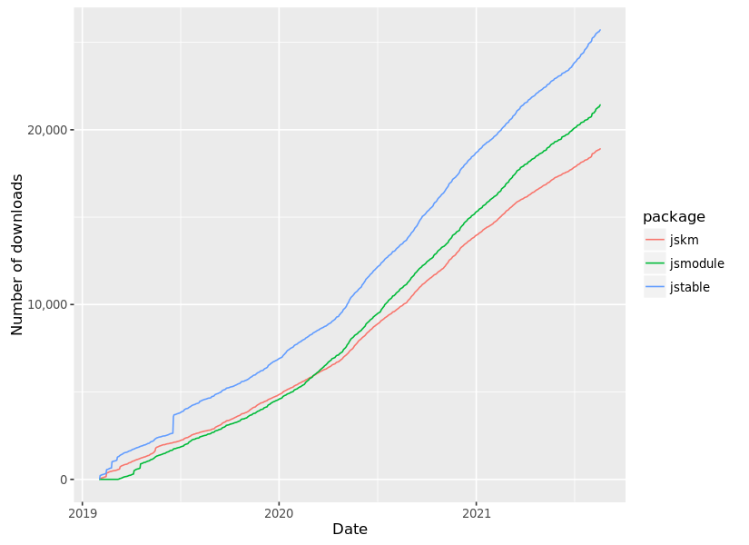
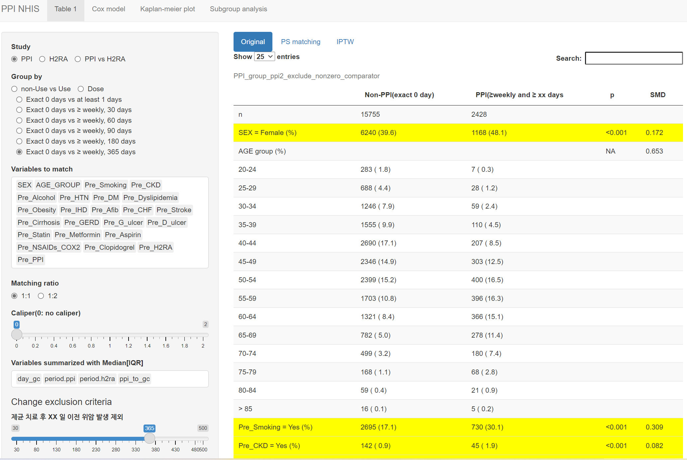

```{r setup, include=FALSE}
options(htmltools.dir.version = FALSE)
knitr::opts_chunk$set(echo = FALSE, fig.align = "center")
library(knitr);library(DT);library(shiny)
```


layout: true

<div class="my-footer"><span><a href="https://www.zarathu.com">Zarathu Co.,Ltd</a>   
&emsp;&emsp;&emsp;&emsp;&emsp;&emsp;&emsp;&emsp;&emsp;&emsp;&emsp;&emsp;&emsp;
&emsp;&emsp;&emsp;&emsp;&emsp;&emsp;&emsp;&emsp;&emsp;&emsp;&emsp;&emsp;&emsp;
<a href="https://github.com/jinseob2kim">김진섭</a></span></div> 


---
# Executive summary

[R](https://www.r-project.org/) 로 보험공단/심평원 빅데이터 분석가능.
- 공단표본코호트 V1 은 내부 분석환경 구축

- 공단표본코호트 V2, 심평원 데이터는 원격 분석환경 이용

- 대용량데이터 위한 R 패키지: [data.table](https://github.com/Rdatatable/data.table), [fst](https://www.fstpackage.org/), [parallel](https://stat.ethz.ch/R-manual/R-devel/library/parallel/doc/parallel.pdf)


--
자체개발 R 패키지 CRAN 배포, 원격분석환경에서도 이용가능.
- Kaplan-meier 그림 [jskm](https://github.com/jinseob2kim/jskm), 논문용 테이블 [jstable](https://github.com/jinseob2kim/jstable), GUI 분석 [jsmodule](https://github.com/jinseob2kim/jsmodule)


--
[Shiny](https://shiny.rstudio.com/) 로 웹기반 실시간 분석서비스.

- 내부 분석환경: 웹에서 실시간 분석수행 

- 원격 분석환경: 모든 분석결과 반출 후 웹기반 시각화

- Excel/PPT 다운로드


--
CDM 다기관 메타분석 서비스
- Table 1 합치기, Forest/Funnel plot 등


---

class: center, middle

# With R

---
# KNHIS

.large[
표본코호트 
- V1(02-13): 파일 보유, 자체 RStudio server에 구축

- V2(02-15): 구매 후 원격접속(접속할때마다 SMS 인증)


맞춤형 데이터
- 명동/원주 분석실 가야함.

- 데이터 신청과정에서 분석언어 선택: SAS vs R/python 
]

--
.large[
**CRAN 패키지만 설치가능**, github 패키지 불가
- R version 문제로 CRAN 패키지도 설치안되기도..
]


---
# HIRA

.large[
맞춤형 데이터 
- **원격분석 가능**

- **고정 IP 필수**, 2개 IP만 등록가능

- 마찬가지로 **CRAN 패키지만 설치가능**
]


---
# 필수 패키지

.large[
[haven](https://haven.tidyverse.org/): SAS to csv
- SAS에서 csv export는 너무 오래걸림


[data.table](https://github.com/Rdatatable/data.table)
- 대용량, 빠른 데이터 처리하려면 필수. 

- 문법 간결하나 직관성 떨어짐. 


[fst](https://www.fstpackage.org/)
- 가장 빠른 파일읽기, [data.table](https://github.com/Rdatatable/data.table) 지원


[parallel](https://stat.ethz.ch/R-manual/R-devel/library/parallel/doc/parallel.pdf)
- 서버 multicore 활용


]


---
# 자체개발 패키지: [jskm](https://github.com/jinseob2kim/jskm)

.large[
Kaplan-meier: IPTW, landmark analysis 지원
]


---
# [jstable](https://github.com/jinseob2kim/jstable)

.large[
논문용 테이블 만들기
- GLM, GEE, Mixed model, Cox, marginal cox, svyglm, svycox
]

```{r, echo = T}
library(jstable)
glm_binomial <- glm(vs~cyl + disp, data = mtcars, family = binomial)
glmshow.display(glm_binomial, decimal = 2)
```


---
# [jsmodule](https://github.com/jinseob2kim/jsmodule)

.large[
GUI 분석: PS matching, 반복측정, survey 지원
- [app.zarathu.com](app.zarathu.com) 이용, 웹에서 바로 가능
]


---
# Download

<center>
</a>
</center>

.large[
- 공단/심평원 R 버전이 낮으면 설치안될수도..
]


---

class: center, middle

# Web with shiny


---
# 자체서버: 실시간 분석웹


<center>
<a href="http://147.47.68.165:1111/doctorssi/PPI_NHIS/"></a>
</center>


---
# 원격서버: 결과반출 후 시각화


.large[
분석 옵션마다 결과 반출 후 모아서 웹으로 만듦
- [예](http://147.47.68.165:1111/doctorssi/osteoporosis_v5/)

테이블은 엑셀, 그림은 PPT 로 다운받고 수정 가능.

]


---
# [Meta분석 웹서비스](http://app.zarathu.com/meta-analysis/)

논문쓰려면 다기관 CDM 결과를 합쳐야됨
- 합친 table 1, forestplot, funnelplot 등 


---

# Executive summary

[R](https://www.r-project.org/) 로 보험공단/심평원 빅데이터 분석가능.
- 공단표본코호트 V1 은 내부 분석환경 구축

- 공단표본코호트 V2, 심평원 데이터는 원격 분석환경 이용

- 대용량데이터 위한 R 패키지: [data.table](https://github.com/Rdatatable/data.table), [fst](https://www.fstpackage.org/), [parallel](https://stat.ethz.ch/R-manual/R-devel/library/parallel/doc/parallel.pdf)


자체개발 R 패키지 CRAN 배포, 원격분석환경에서도 이용가능.
- Kaplan-meier 그림 [jskm](https://github.com/jinseob2kim/jskm), 논문용 테이블 [jstable](https://github.com/jinseob2kim/jstable), GUI 분석 [jsmodule](https://github.com/jinseob2kim/jsmodule)


[Shiny](https://shiny.rstudio.com/) 로 웹기반 실시간 분석서비스.

- 내부 분석환경: 웹에서 실시간 분석수행 

- 원격 분석환경: 모든 분석결과 반출 후 웹기반 시각화

- Excel/PPT 다운로드

CDM 다기관 메타분석 서비스
- Table 1 합치기, Forest/Funnel plot 등

---

class: center, middle

# END
