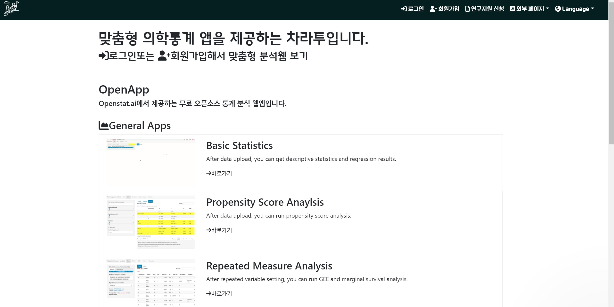

```{r setup, include=FALSE}
options(htmltools.dir.version = FALSE)
knitr::opts_chunk$set(echo = FALSE, fig.align = "center", message = F, warning = F)
library(knitr);library(DT);library(shiny);library(survival);library(survsim)
data.t <- data.frame(sex = sample(c("Male", "Female"), 30, replace = T), tChol = round(rnorm(30, mean = 150, sd = 30)))
data.fisher <- data.frame(HTN_medi = round(rbinom(50, 1, 0.2)), DM_medi = round(rbinom(50, 1, 0.2)))
```

layout: true

<div class="my-footer"><span><a href="https://www.zarathu.com">Zarathu Co.,Ltd</a>   
&emsp;&emsp;&emsp;&emsp;&emsp;&emsp;&emsp;&emsp;&emsp;&emsp;&emsp;&emsp;&emsp;
&emsp;&emsp;&emsp;&emsp;&emsp;&emsp;&emsp;&emsp;&emsp;&emsp;&emsp;&emsp;&emsp;
<a href="https://github.com/jinseob2kim">김진섭</a></span></div> 


---

# Executive summary

**Table 1**
- 연속변수 2그룹: 정규분포 **t-test**, 아니면 **Wilcox-test**
- 연속변수 3그룹이상: 정규분포 **ANOVA**, 아니면 **Kruskal–Wallis ANOVA**
- 범주형 변수: 샘플수 충분하면 **Chisq-test**, 아니면 **Fisher-test**


**회귀분석**
- **Univariate, multivariate** 같이 보여주기, **Subgroup** 분석 추천
- **Stepwise selection 비추천**: 예측모형 목적 아님, 임상맥락 고려X


**생존분석**
- Kaplan-meier 그림선 겹치면 안됨: **Time stratification** 필요 
- 보정할 변수가 Index time 이후면 안됨: **Time-dependent covariate** 필요
- Propensity score 매칭 후 pair 고려한 **stratified cox 는 필수아님**


**국민건강영양조사**
- **표본추출정보를 고려**한 통계분석: Survey table1/GLM/Cox


---

class: center, middle


# 소개 


---
# 맞춤형 통계웹

<center>
</a>
</center>

---
# [공개 통계웹](http://app.zarathu.com) 

<center>
</a>
</center>


---
# 주요 계약 


- 대한심혈관중재학회 [COBIS III 레지스트리](https://clinicaltrials.gov/ct2/show/NCT03068494) 분석: [추가계약](http://pf.kakao.com/_XsuxgC/48388190)


- 서울성모병원 [COREA-AMI II 레지스트리](https://clinicaltrials.gov/ct2/show/NCT02806102) 분석: [10개 연구 계약](http://pf.kakao.com/_XsuxgC/48043955)


- 삼성서울병원 [공통데이터모델(CDM)](http://www.feedernet.org/html/?pmode=cdmdrn) 분석: [심평원 코로나데이터](https://hira-covid19.net/) 분석 중 


- 강동성심병원 CDM 분석지원: 공단표본데이터 분석 중 


- 경기도감염병관리지원단 코로나 대시보드 with Shinykorea: [최종보고](https://shinykorea.github.io/corona-activityrecord) 


- 삼성서울병원 이식외과 육종(sarcoma) 데이터 분석: [5개 연구 계약](http://pf.kakao.com/_XsuxgC/51701089) 


- 해운대백병원 정신질환 네트워크분석: [논문 5편](http://pf.kakao.com/_XsuxgC/52664370) 게재


- 성균관의대 환경역학연구실 [미세먼지 대시보드](http://pf.kakao.com/_XsuxgC/43627405)


- [삼성서울병원 정신과, 응급의학과, 임상역학센터 통계자문계약](http://pf.kakao.com/_XsuxgC/55192190)

- [서울대병원 순환기내과 통계자문계약](http://pf.kakao.com/_XsuxgC/55577702)


---
# 주요 논문 성과 

.large[
SCI 논문 200건 지원
]
<center>
</a>
</center>


---
class: center, middle

# 의학통계 Tip

---
# 연구의 흐름?

.large[
- **Table 1**으로 데이터를 보여주고

- **단변량(univariate)** 분석으로 가설검정

- **다변량(multivariate)** or 소그룹(subgroup) 분석: 다른 변수들의 효과를 보정.
]

---
class: center, middle

# 연속 변수의 그룹 비교


---
# 2그룹: t-test

.large[
2 그룹 **평균** 비교

- 각 그룹의 평균과 표준편차 필요.

https://www.evanmiller.org/ab-testing/t-test.html 에서 바로 가능.
]

---

```{r, echo = F}
data.t <- data.frame(sex = sample(c("Male", "Female"), 30, replace = T), tChol = round(rnorm(30, mean = 150, sd = 30)))
rownames(data.t) <- paste("person", 1:30)
datatable(data.t, rownames = T, caption = "data.t: sex and total cholesterol")
```

---

```{r, echo = T}
nev.ttest <- t.test(tChol ~ sex, data = data.t, var.equal = F)
nev.ttest
```

.large[
여자의 평균 콜레스테롤 값은 `r round(nev.ttest$estimate[1], 1)`, 남자는 `r round(nev.ttest$estimate[2], 1)` 이고 $p$-value는 `r round(nev.ttest$p.value, 3)`  

]

- `var.equal = F`는 등분산 가정 없이 분석하겠다는 뜻. 등분산 가정이란 두 그룹의 분산이 같다고 가정하는 것인데, 계산이 좀 더 쉽다는 이점이 있으나 아무 근거 없이 분산이 같다고 가정하는 것은 위험한 가정이다.


---

```{r, echo = T}
ev.ttest <- t.test(tChol ~ sex, data = data.t, var.equal = T)
ev.ttest
```


앞서는 **Welch t-test** 였는데 이름이 바뀐 것을 확인할 수 있고 $p$-value도 `r round(ev.ttest$p.value, 3)`로 다름. 
- 특별한 경우가 아니고서야 위험한 등분산가정을 할 필요가 없음.   

- **R** 에서 디폴트도 `F` 임.

- 2그룹에서 ANOVA 하면 (등분산 가정한) t-test와 동일.

  : 등분산 가정없는 ANOVA 도 있음.


---

```{r, fig.width=12}
library(ggpubr)
ggarrange(
  ggboxplot(data.t, "sex", "tChol", fill = "sex"),
  ggbarplot(data.t, "sex", "tChol", fill = "sex", add = "mean_sd")
)
```

---

```{r}
ggboxplot(data.t, "sex", "tChol", fill = "sex", add = "dotplot") + 
  stat_compare_means(method = "t.test", method.args = list(var.equal = F))
```

---
```{r}
ggviolin(data.t, "sex", "tChol", fill = "sex", add = "boxplot") + 
   stat_compare_means(method = "t.test", method.args = list(var.equal = T), label.y = 250)
```


---
# 2그룹: wilcox-test

.large[

정규분포 못믿을때: 2 그룹 **중위값** 비교

- 값 자체가 아닌 순위정보만 이용 - **비모수검정**

- **Median [IQR(25%-75% quantile)]** 로 표시
]

--
.large[
- 정규분포 따르는지 아닌지 테스트하는 정규성검정은 불필요. 

- 임상적으로 판단하는것이 좋다. 키나 몸무게는 정규분포, CRP나 자녀수는 정규분포 안함.
]

- [정규분포 참고자료](https://jinseob2kim.github.io/Normal_distribution.html)

---

```{r, echo = T, warning = F}
res.wilcox <- wilcox.test(tChol ~ sex, data = data.t)
res.wilcox
```

---
```{r}
ggboxplot(data.t, "sex", "tChol", fill = "sex") + 
  stat_compare_means(method = "wilcox.test")
```

---
# 3그룹 이상: 1 way ANOVA

.large[
3 그룹 이상의 평균 비교

- 2그룹씩 짝을 지어서 **t-test**를 반복할 수도 있으나, Table 1은 보통 하나의 $P$-value만 제시함.

- 전체적으로 **튀는 것이 하나라도 있는가?**를 테스트하는 **ANOVA**. 

- 어떤 그룹이 차이나는지는 관심없음.

]

--
- 사후(post-hoc) 분석을 이용, 어떤 것이 튀는지를 알아볼 수도 있다.

- 보통 우리가 쓰는 **ANOVA**는 비교할 모든 그룹에서 분산이 같다는 등분산 가정 하에 분석을 수행하며, 실제로 2 그룹일 때 **ANOVA**를 수행하면 등분산 가정 하에 수행한 **t-test**와 동일한 결과를 얻는다. 물론 등분산 가정없는 generalized ANOVA 도 있고 본사는 이것을 디폴트로 사용한다. 


---

```{r, echo=F}
data.aov <- data.frame(group = sample(c("A", "B", "C"), 30, replace = T), tChol = round(rnorm(30, mean = 150, sd = 30)))
rownames(data.aov) <- paste("person", 1:30)
datatable(data.aov, rownames = T, caption = "data.t: group and total cholesterol")
```

---
```{r, echo = T}
res.aov1 <- oneway.test(tChol ~ group, data = data.aov, var.equal = F)
res.aov1
res.aov2 <- oneway.test(tChol ~ group, data = data.aov, var.equal = T)
res.aov2
```

.large[
> 등분산 가정없는 $p$-value인 `r round(res.aov1$p.value, 3)`를 이용하며, 의미는 "**3 그룹에서 총콜레스테롤 값이 비슷하다**(다른 것이 있다고 할 수 없다)" 이다.
]
---
```{r}
ggboxplot(data.aov, "group", "tChol", fill = "group", order = c("A", "B", "C")) + 
  stat_compare_means(method = "anova")
```

---
```{r}
ggboxplot(data.aov, "group", "tChol", fill = "group", order = c("A", "B", "C")) + 
  stat_compare_means(method = "anova", label.y = 250) + 
  stat_compare_means(method = "t.test", comparisons = list(c("A", "B"), c("B", "C"), c("C", "A")))
```


---
# 3그룹이상: Kruskal–Wallis ANOVA

.large[

정규분포 못믿을때: 3 그룹 **중위값** 비교

- 값 자체가 아닌 순위정보만 이용 - **비모수검정**

- **Median [IQR(25%-75% quantile)]** 로 표시
]

---
```{r, echo = T}
res.kruskal <- kruskal.test(tChol ~ group, data = data.aov)
res.kruskal
```

.large[
> $p$-value는 `r round(res.kruskal$p.value, 3)`. 
]
---
```{r}
ggboxplot(data.aov, "group", "tChol", fill = "group", order = c("A", "B", "C")) + 
  stat_compare_means(method = "kruskal.test")
```


---
class: center, middle

# 범주형 변수의 그룹 비교

### 그룹 수나 정규분포를 고려할 필요가 없어 연속 변수일 때보다 훨씬 간단하며 딱 하나, **샘플 수**가 충분한지만 확인하면 된다.


---
# 샘플 수 충분: Chi-square test

.large[
**Chi-square test**는 두 범주형 변수가 관계가 있는지 없는지를 파악하는 테스트.

]

- 세 범주형 변수일 때도 이용할 수 있으나 본 강의에서는 생략한다.


---

```{r, echo=F}
set.seed(222)
data.chi <- data.frame(HTN_medi = round(rbinom(50, 1, 0.4)), DM_medi = round(rbinom(50, 1, 0.4)))
rownames(data.chi) <- paste("person", 1:50)
datatable(data.chi, rownames = T, caption = "data.chi: HTN & DM medication")
```


---
```{r, echo = T}
tb.chi <- table(data.chi)
tb.chi
```

언뜻 봐서는 관계가 있는지 아닌지 잘 모르겠다. **Chi-square test**를 해보자.

--

```{r, echo = T}
res.chi <- chisq.test(tb.chi)
res.chi
```

 > $p$-value는 `r round(res.chi$p.value, 3)`, **혈압약 복용과 당뇨약 복용은 유의한 관계가 없다**고 말할 수 있다. 

---
# 샘플 수 부족: Fisher's exact test

.large[
분석할 테이블에서 **샘플 수가 너무 작은 항이 있으면** **chi-square test** 가 부정확해진다. 이 때는 **fisher's exact test**를 쓴다. 

- 현 상황보다 더 극한 상황이 나올 확률을 [직접 계산](https://techntalk.tistory.com/entry/%ED%94%BC%EC%85%94%EC%9D%98-%EC%A0%95%ED%99%95%EB%8F%84-%EA%B2%80%EC%A0%95Fishers-Exact-Probability-Test)함.  
]


---

```{r, echo = F}
set.seed(222)
data.fisher <- data.frame(HTN_medi = round(rbinom(50, 1, 0.2)), DM_medi = round(rbinom(50, 1, 0.2)))
rownames(data.fisher) <- paste("person", 1:50)
datatable(data.fisher, rownames = T, caption = "data.fisher: HTN & DM medication")
```

---

아까와 마찬가지로 테이블로 두 약물 복용상태를 비교하면 아래와 같다.

```{r, echo = T}
tb.fisher <- table(data.fisher)
tb.fisher
```

--
혈압약과 당뇨약을 모두 복용한 사람이 `r tb.fisher[2, 2]`명으로 좀 작아보이지만 무시하고 **chi-square test**를 수행하면 결과는 나오나 `Warning` 메시지가 뜬다.  


```{r, echo = T, warning = T}
chisq.test(tb.fisher)
```

**두 약을 모두 복용한 사람이 2명뿐**, 분석할 테이블에서 샘플 수가 너무 작은 항이 있으면 **chi-square test**의 계산이 부정확해진다.


---

**fisher's exact test** 를 해 보자.

```{r, echo = T}
res.fisher <- fisher.test(tb.fisher)
res.fisher
```

.large[
> $p$-value는 `r round(res.fisher$p.value, 3)`, 마찬가지로 혈압약 복용과 당뇨약 복용은 유의한 관계가 없다고 할 수 있다. 
]

--
의문: **무조건 fisher's test만 하면 간단한데** **chi-square test**는 왜 하나?

- 샘플 수가 작을 때는 **fisher's test**만 하는 것이 실제로 더 간단하고 방법론적으로도 아무 문제가 없다. 그러나 샘플 수나 그룹 수가 늘어날수록 **fisher's test**는 계산량이 급격하게 증가한다. **chi-square test**를 먼저 수행하는 것을 권유한다.   


---
class: center, middle

# 연속변수의 짝지은 그룹비교

### Paired t-test


---
# 2그룹 : Paired t-test

각 사람의 혈압을 한 번은 사람이 직접, 한 번은 자동혈압계로 측정했다고 하자. 이 때 직접 잰 혈압과 자동혈압계의 측정값을 비교한다면 **t-test**로 충분할까? 

- t-test는 혈압 재는 방법마다 **평균을 먼저 구한 후** 그것이 같은지를 테스트하므로  **짝지은 정보를 활용하지 못한다.** 

- 각 사람마다 두 혈압값의 **차이를 먼저 구한 후** 평균이 0인지를 테스트하면, **짝지은 정보를 활용**하면서 계산도 더 간단한 방법이 된다.


--
.large[
- **차이값을 먼저 구한 후** 그 평균이 0인지를 테스트하는 방법이 **paired t-test**
]


---
```{r, echo = F}
data.pt <- data.frame(SBP_hand = round(rnorm(30, mean = 125, sd = 5)), SBP_machine = round(rnorm(30, mean = 125, sd = 5)))
rownames(data.pt) <- paste("person", 1:30)
datatable(data.pt, rownames = T, caption = "data.pt: systolic blood pressure measured by hand & machine")
```


---
그냥 t-test 로 비교해보자.

```{r, echo = T}
pt.ttest <- t.test(data.pt$SBP_hand, data.pt$SBP_machine)
pt.ttest
```

각 방법의 **평균을 먼저 구한 후 차이를 비교** 했고, $p$-value는 `r round(pt.ttest$p.value, 3)`이다. 이제 **paired t-test**를 수행하자. 


---
```{r, echo = T}
pt.ttest.pair <- t.test(data.pt$SBP_hand, data.pt$SBP_machine, paired = TRUE)
pt.ttest.pair
```

이번에는 **사람마다 차이값을 먼저 구한 후 그것이 0인지 테스트** 했고, $p$-value는 `r round(pt.ttest.pair$p.value, 3)`이다.  


---
```{r}
ggpaired(data.pt, cond1 = "SBP_hand", cond2 = "SBP_machine", fill = "condition", palette = "jco") + 
  stat_compare_means(method = "t.test", paired = T)
```


---
**Paired t-test**의 비모수버전은 **wilcoxon-signed rank test** 이며 아래와 같이 실행한다. 

```{r, echo = T}
pt.wilcox.pair <- wilcox.test(data.pt$SBP_hand, data.pt$SBP_machine, paired = T)
pt.wilcox.pair
```

- 본 강의에서는 다루지 않겠지만 짝지은 3개 이상의 그룹은 [**repeated measure ANOVA**](https://statistics.laerd.com/statistical-guides/repeated-measures-anova-statistical-guide.php) 를 이용한다. 


---
```{r}
ggpaired(data.pt, cond1 = "SBP_hand", cond2 = "SBP_machine", fill = "condition", palette = "jco") + 
  stat_compare_means(method = "wilcox.test", paired = T)
```

---
class: center, middle

# 범주형 변수의 짝지은 그룹비교

### Mcnemar test, Symmetry test for a paired contingency table

---
# 2그룹: Mcnemar test

.large[
약 복용 전후로 복통증상 발생에 차이가 있는지 알아본다고 하자.
]


---

```{r, echo = F}
data.mc <- data.frame(Pain_before = round(rbinom(30, 1, 0.5)), Pain_after = round(rbinom(30, 1, 0.5)))
rownames(data.mc) <- paste("person", 1:30)
datatable(data.mc, rownames = T, caption = "data.mc: Abdominal pain - before & after")
```

---

이 데이터를 2 by 2 테이블로 정리하면 아래와 같다. 

```{r, echo = T}
table.mc <- table(data.mc)
table.mc
```

--
먼저 앞서 배운 **Chi-sqaure test** 를 이용한 결과를 보자.

```{r, echo = T}
mc.chi <- chisq.test(table.mc)
mc.chi
```

이것은 약 복용 전 복통 증상과 복용 후의 복통 증상이 얼마나 관계가 있는지 알아보는 테스트로 **짝지은 정보를 활용하지 않는다**. 


---
짝지은 정보를 활용하는 **mcnemar test**를 수행하자.

```{r, echo = T}
mc.mcnemar <- mcnemar.test(table.mc)
mc.mcnemar
```

.large[
> **Mcnemar test**는 약 복용후 증상발생이 달라진 사람 즉, **discordant pair**만 분석에 이용한다. 따라서 **condordant pair** 가 어떻든지 통계결과는 동일하게 나온다.
]

---
# 3그룹: symmetry test

.large[
Symmetry test for a paired contingency table*

- Mcnemar test의 일반화, 3그룹 이상에서도 가능. 
]

http://rcompanion.org/handbook/H_05.html


```{r, echo = F}
library(rcompanion)
## Example data
data(AndersonRainGarden) 
AndersonRainGarden       
```

---

`nominalSymmetryTest` 함수를 쓴다.

```{r, echo = T}
## Symmetry test
nominalSymmetryTest(AndersonRainGarden)
```

---
class: center, middle

# 회귀분석


---
# Example data 

```{r, echo=F}
rmarkdown::paged_table(colon)
```


---
class: center, middle

# Linear regression

### Continuous


---
# Simple 

```{r, echo=F, fig.align='center'}
include_graphics("https://nextjournal.com/data/QmfPuPp4V74FyvTTojMj6ix9T8Skj1ji4GhX5Pr6zK8w4N?filename=linear-regression.png&content-type=image/png")
```

.large[
$$Y = \beta_0 + \beta_1 X + \epsilon$$
]

- 오차제곱합을 최소로하는 $\beta_0, \beta_1$ 구한다.

- $Y$ 정규분포하는 연속변수, $X$ 는 연속, 범주형 다 가능
    + $X$ 연속변수일 땐 **상관분석** 과 동일
    + $X$ 2범주일 땐 **`t.test` with 등분산** 과 동일


---

```{r}
cor.test(colon$age, colon$nodes)
summary(lm(nodes ~ age, data = colon))$coefficients
summary(glm(age ~ nodes, data = colon))$coefficients
```


---

```{r}
t.test(time ~ sex, data = colon, var.equal = T)
summary(lm(time ~ sex, data = colon))$coefficients
```


---
# 3범주 이상?

**rx**: 치료법 3개

```{r}
levels(colon$rx)
```

**더미변수로** 자동으로 바뀐 후 회귀식에 포함. 실제로는 변수 2개가 들어감

```{r}
tail(model.matrix(time ~ rx, data = colon))
```

둘다 0 이면 **Obs** (reference)


---

```{r}
summary(lm(time ~ rx, data = colon))$coefficients
```

**Obs와 Lev+5FU** 군이 유의한 차이가 있음. **ANOVA** 형태로도 볼 수 있다 (등분산 가정).

```{r}
anova(lm(time ~ rx, data = colon))
```

ANOVA p-value 는 **rx 중 튀는 것이 있는지?** 를 통합평가.  


---
# Multiple

여러 변수들을 포함 

.large[
$$Y = \beta_0 + \beta_1 X_{1} + \beta_2 X_{2} + \cdots + \epsilon$$
]

- $\beta_1$ 해석: $X_2, X_3 \cdots$ 를 보정한다면, $X_1$ 이 1 증가할 때 $Y$ 가 $\beta_1$ 만큼 증가한다.


--

```{r}
summary(lm(time ~ sex + age + rx, data = colon))$coefficients
```

.large[

논문용 테이블은 **보정 전후 결과를 같이** 보여주는 것이 대세
]

---

```{r, echo=F}
library(jstable)
tb.linear <- glmshow.display(glm(time ~ sex + age + rx, data = colon))
out.linear <- jstable::LabelepiDisplay(tb.linear)
hide <- which(colnames(out.linear) == "sig")
datatable(out.linear, rownames=T, caption = tb.linear$first.line,
              options = c(list(columnDefs = list(list(visible=FALSE, targets =hide))
                          ),
                          list(scrollX = TRUE)
              )
    ) %>% formatStyle("sig", target = 'row',backgroundColor = styleEqual("**", 'yellow'))    
```


---

class: center, middle
# Logistic regression

### 0/1 


---

```{r, echo=F, fig.align='center'}
include_graphics("https://static.javatpoint.com/tutorial/machine-learning/images/linear-regression-vs-logistic-regression.png")
```

.large[
$$ P(Y = 1) = \frac{\exp{(X)}}{1 + \exp{(X)}}$$
]


---
# Odds Ratio

.large[


$$
\begin{aligned}
 P(Y = 1) &= \frac{\exp{(\beta_0 + \beta_1 X_1 + \beta_2 X_2 + \cdots)}}{1 + \exp{(\beta_0 + \beta_1 X_1 + \beta_2 X_2 + \cdots)}} \\\\
 \ln(\frac{p}{1-p}) &= \beta_0 + \beta_1 X_1 + \beta_2 X_2 + \cdots
\end{aligned}
$$
]

--
.large[

$\beta_1$ 해석: $X_2, X_3 \cdots$ 들 보정한다면, $X_1$이 1 증가할 때, $\ln(\frac{p}{1-p})$ 가 $\beta_1$ 만큼 증가한다.

> $\frac{p}{1-p}$ 가 $\exp(\beta_1)$ 배 증가한다. 즉 Odd Ratio =  $\exp(\beta_1)$
]

---

```{r}
summary(glm(status ~ sex + age + rx, data = colon, family = binomial))
```


---

```{r, echo=F}
tb.linear <- glmshow.display(glm(status ~ sex + age + rx, data = colon, family = binomial))
out.linear <- jstable::LabelepiDisplay(tb.linear)
hide <- which(colnames(out.linear) == "sig")
datatable(out.linear, rownames=T, caption = tb.linear$first.line,
              options = c(list(columnDefs = list(list(visible=FALSE, targets =hide))
                          ),
                          list(scrollX = TRUE)
              )
    ) %>% formatStyle("sig", target = 'row',backgroundColor = styleEqual("**", 'yellow'))    
```


---
# Stepwise selection

.large[
- 다변량 포함 기준은 **임상적 중요성 or 단변량 유의성**

- Stepwise selection은 임상적 중요성도 무시, 통계학적 논리도 부족
]


---
# Subgroup analysis

.large[
**다변량분석보다 더 좋은 증거**
]
- 예) 성별 보정 < 성별에 따른 subgroup 분석

.large[
**Interaction 포함한 forest plot** 추천
]


<center>
</a>
</center>


---

class: center, middle
# Cox proportional hazard

### Time & Event 

---

# Time to event data

```{r, echo=F, fig.align='center'}
library(jskm)
include_graphics("https://miro.medium.com/max/1440/1*S3lbo8tbgtklE7V-m4EsvQ.jpeg")
```

.large[
대부분 **Right censored**: XX 일에 사망 or XX 일 까지 생존
]


---

# Time to event 를 하나의 변수로 

```{r, echo=F}
rmarkdown::paged_table(data.frame(time = colon$time, status = colon$status, surv = with(colon, Surv(time, status))))
```


---
# Kaplan-meier plot

.large[
생존분석에서 table 1의 의미

- 보통 **logrank test p-value** 를 같이 보여줌.
]

```{r, fig.align='center', fig.width=6.4, fig.height=4.5, dpi=300, out.width="50%"}
jskm(survfit(Surv(time, status) ~ rx, data = colon), table = T, pval = T, marks = F)
```


---

```{r}
summary(survfit(Surv(time, status) ~ rx, data = colon))
```

---
# Logrank test

구간별로 예상/기대 발생 수 계산 후 합쳐서 카이제곱검정 

```{r}
survdiff(Surv(time, status) ~ rx, data = colon)
```

각 구간들의 결과를 합친다?

- 구간별 **발생 양상이 비슷**하다는 가정 (**비례위험(proportional hazards) 가정**)


---
# Cox model

.large[
Hazard function: $h(t)$

- $t$ 까진 생존하고 $t$ 직후에 사망할 가능성

Cox model: **Hazard Ratio(HR)** 을 평가


$$
\begin{aligned}
h(t) &= \exp({\beta_0 + \beta_1 X_1 + \beta_2 X_2 + \cdots}) \\\\
     &= h_0(t) \exp({\beta_1 X_1 + \beta_2 X_2 + \cdots})     
\end{aligned}
$$
$X_1$ 1 증가할 때 $h(t)$ 는 $\exp(\beta_1)$ 배 증가. 즉

$$\text{HR} = \exp{(\beta_1)}$$

]

---
# 특징

.large[
Kaplan-meier 와 마찬가지로 구간별로 통계량을 계산. 
- 구간별 양상 비슷하다는 **비례위험가정**


**Time independent HR**: 시간은 $h_0(t)$ 에만.
- 모형이 심플: HR 값이 시간에 상관없이 일정함
- Time dependent cox 도 가능.


$h_0(t)$ 는 구하지 않는다. 계산 간단해지는 장점
- Cox 가 준모수(semi-parametric) 방법이라고 불리는 이유
- 예측모형 만들땐 문제. $h_0(t)$ 를 따로 얻어야 함.

]

---

```{r}
summary(coxph(Surv(time, status) ~ sex + age + rx, data = colon))
```


---

```{r, echo=F}
res.cox <- coxph(Surv(time, status) ~ sex + age + rx, data = colon, model = T)
tb.cox <- jstable::cox2.display(res.cox, dec = 2)
#tb.cox <- jstable::LabeljsCox(tb.cox)
out.cox <- rbind(tb.cox$table, tb.cox$metric)
sig <- out.cox[, ncol(out.cox)]
sig <- gsub("< ", "", sig)
sig <- ifelse(as.numeric(as.vector(sig)) <= 0.05, "**", NA)
out.cox <- cbind(out.cox, sig)
hide <- which(colnames(out.cox) == c("sig"))
    datatable(out.cox, rownames=T, caption = tb.cox$caption,
              options = c(
                          list(columnDefs = list(list(visible=FALSE, targets= hide))
                          )
              )
    )  %>% formatStyle("sig", target = 'row',backgroundColor = styleEqual("**", 'yellow'))        
    
    
```

---
# 생존분석: 비례위험가정

.large[
트렌드 일정하다는 가정: **생존곡선 겹치면 안됨**
]
- 비례위험가정 test까진 필요없음: 그림으로 확인

<center>
</a>
</center>


---
# Landmark-analysis

.large[
시간 나눠 따로 분석]
<center>
</a>
</center>

---
# Time-dependent cox

```{r}
vet2 <- survSplit(Surv(time, status) ~ ., data = veteran, cut=c(90, 180), episode = "tgroup", id = "id")
rmarkdown::paged_table(vet2)

```
---
# Time-dependet cox

```{r}
vfit2 <- coxph(Surv(tstart, time, status) ~ trt + prior + karno:strata(tgroup), data=vet2)
summary(vfit2)

```


---
# Time-dependent covariate

.large[
생존분석 **모든 변수는 Index date 이전에 측정**해야
]
- 예) F/U lab, medication
.large[
Time-dependent covariate 다루려면 이를 고려한 cox 필요
]

```{r}
N=100 #number of patients
set.seed(123)
df.tf<-simple.surv.sim(#baseline time fixed
 n=N, foltime=500,
 dist.ev=c('llogistic'),
 anc.ev=c(0.68), beta0.ev=c(5.8),
 anc.cens=1.2,
 beta0.cens=7.4,
 z=list(c("unif", 0.8, 1.2)),
 beta=list(c(-0.4),c(0)),
 x=list(c("bern", 0.5),
 c("normal", 70, 13)))
for (v in 4:7){
  df.tf[[v]] <- round(df.tf[[v]])
}
names(df.tf)[c(1,4,6,7)]<-c("id", "time", "grp","age")
df.tf <- df.tf[, -3]
 nft<-sample(1:10,
 N,replace=T)#number of follow up time points
crp<-round(abs(rnorm(sum(nft)+N,
 mean=100,sd=40)),1)
time<-NA
id<-NA
i=0
for(n in nft){
i=i+1
time.n<-sample(1:500,n)
time.n<-c(0,sort(time.n))
time<-c(time,time.n)
id.n<-rep(i,n+1)
id<-c(id,id.n)
}
df.td <- cbind(data.frame(id,time)[-1,],crp)


df <- tmerge(df.tf, df.tf, id = id, status1 = event(time, status))
df2 <- tmerge(df, df.td, id = id, crp = tdc(time, crp))
rmarkdown::paged_table(df2)
```


---
class: center, middle

# Others


---
# PS matching: Stratified cox

.large[
Propensity score 매칭 후 **stratified cox 필수 아님**
]

- Stratified: 매칭쌍끼리는 **baseline hazard**가 같고, **다른 쌍끼린 다르다**는 가정.

- No stratified: baseline hazard **전부 동일**하다는 가정

.large[
1:1 매칭이면 $\dfrac{N}{2}$ 개나 strata가 생김. 의미 없음

1:다 매칭으로 strata갯수가 적으면 고려할 수도?
]


---
# 국민건강영양조사

**2-stage cluster sampling**
- **psu(1차집락)**: 서울전체 랜덤 200명(X), 서울 특정 지역 골라서 200명(O)
- **kstrata(2차집락)**: 지역과 집의 형태 (아파트/일반주택) 
- **wt(가중치)**: 인원이 적은데 사회적으로 혹은 학문적으로 배려해야 할 경우 대상자를 조금 많이 모집한 후 가중치를 줄여서 반영, 영양/설문/임상 검사에 따라 가중치종류 다름름 

**SAS** surveyreg surveylogistic, **R** svyglm svycox

<center>
</a>
</center>


---

# Executive summary

**Table 1**
- 연속변수 2그룹: 정규분포 **t-test**, 아니면 **Wilcox-test**
- 연속변수 3그룹이상: 정규분포 **ANOVA**, 아니면 **Kruskal–Wallis ANOVA**
- 범주형 변수: 샘플수 충분하면 **Chisq-test**, 아니면 **Fisher-test**


**회귀분석**
- **Univariate, multivariate** 같이 보여주기, **Subgroup** 분석 추천
- **Stepwise selection 비추천**: 예측모형 목적 아님, 임상맥락 고려X


**생존분석**
- Kaplan-meier 그림선 겹치면 안됨: **Time stratification** 필요 
- 보정할 변수가 Index time 이후면 안됨: **Time-dependent covariate** 필요
- Propensity score 매칭 후 pair 고려한 **stratified cox 는 필수아님**


**국민건강영양조사**
- **표본추출정보를 고려**한 통계분석: Survey table1/GLM/Cox


---
class: center, middle

# END
