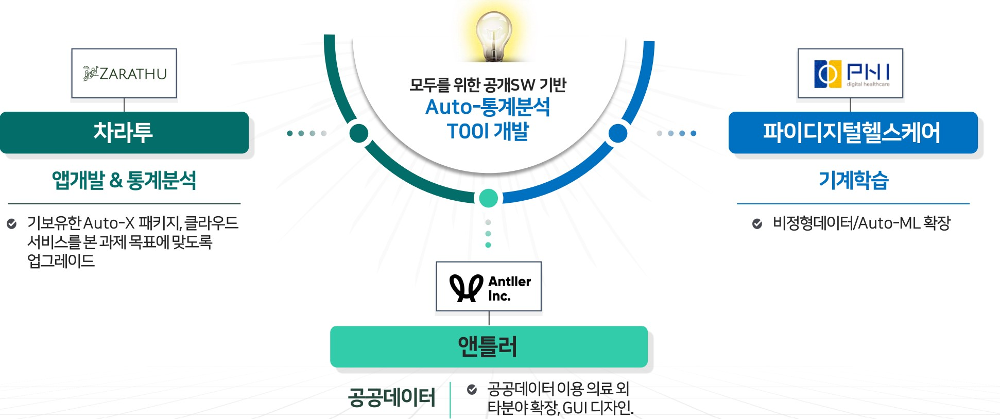
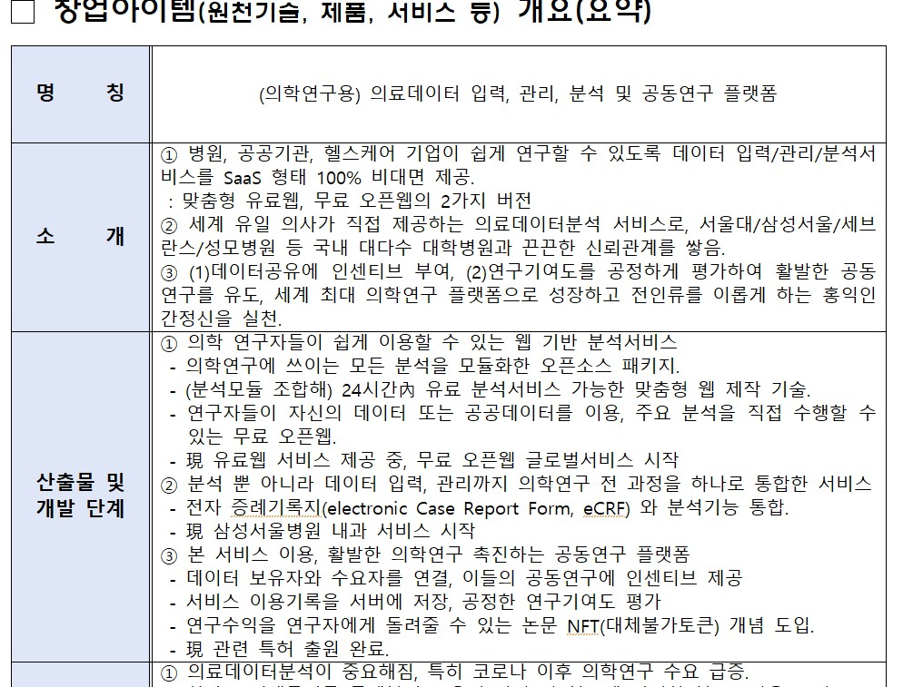
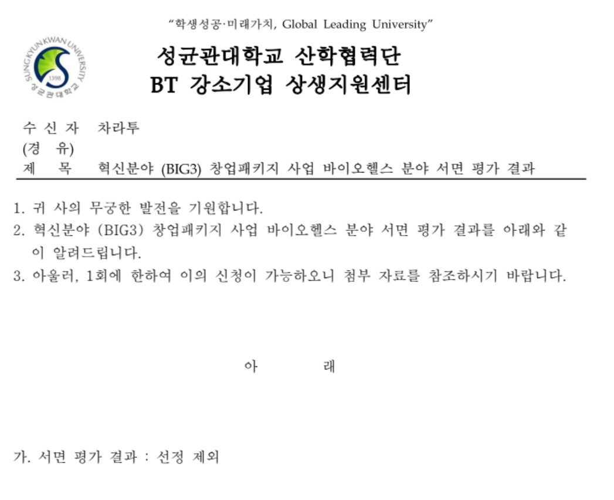

```{r setup, include=FALSE}
options(htmltools.dir.version = FALSE)
knitr::opts_chunk$set(echo = FALSE, fig.align = "center", message = F, warning = F)
library(knitr);library(DT)
```

layout: true

<div class="my-footer"><span><a href="https://www.zarathu.com">Zarathu Co.,Ltd</a>   
&emsp;&emsp;&emsp;&emsp;&emsp;&emsp;&emsp;&emsp;&emsp;&emsp;&emsp;&emsp;&emsp;
&emsp;&emsp;&emsp;&emsp;&emsp;&emsp;&emsp;&emsp;&emsp;&emsp;&emsp;&emsp;&emsp;
<a href="https://github.com/jinseob2kim">김진섭</a></span></div> 


---

# Executive summary

.small[
**사무실**
- 송파ICT청년창업지원센터 입주, 기업부설연구소 설립
- 공개SW 창업기업 6개월 연장(선릉 저스트코타워)

**R&D 과제**
- 창업성장기술개발사업(디딤돌 첫걸음) 서류탈락
- 정보통신·방송 기술개발사업 앤틀러과 같이 지원, 6:1 경쟁률 결과 기다리는중 

**창업지원사업**
- 혁신분야 창업패키지(BIG3), SW고성장기업 서류탈락
- 창업도약패키지 심사중, 클라우드서비스 이용지원, Datastars 심사중 

**특허지원사업**
- 국제 지재권분쟁 대응전략 지원사업(특허) 심사중

**멘토링**
- SW마에스트로 기술멘토 선정, 한이음멘토링 선정
- 오픈소스 컨트리뷰톤 심사중

**고용지원, 인턴십, 기타**
- `21 청년디지털일자리, 미래청년인재육성사업 TO 5명 
- '22년 일경험프로그램 TO 1명, 송파구 중소기업 청년취업인턴제 TO 1명
- 숭실대 스타트업 인턴십 2명(6주)
- ICT 학점연계 프로젝트 인턴십 TO 1명
- 인공지능고성능컴퓨팅지원 3년 연속 선정

]


---

class: center, middle


# 사무실


---
# [송파ICT청년창업지원센터](http://songpaict.com/)

.large[
가락시장역 부근 4인실 선정(월 30만원, 보증금 無)

- 약 20팀 선발, 1년기간
- 블록체인기반 의료데이터 입력,관리, 분석 플랫폼: 이전발표와 95% 유사
- AWS 10,000$, 네이버클라우드 300만원 바우처 제공 
]

<center>
<a href="http://songpaict.com/"></a>
</center>


---
# 4인실쪼개서 기업부설연구소

.large[
4인실 칸막이로 나눠 연구소설립
- 벤처기업은 연구인력 2인필요(학사졸 이상)
- R&D 과제 지원자격(기업부설연구소 or 연구개발전담부서)
]

다음의 경우에 한하여, 연구소/전담부서가 면적 50㎡ 이하인 연구공간을 별도의 출입문을 갖추지 않고 다른 부서와 칸막이 등으로 구분하여 운영할 수 있음(연구소/전담부서 현판을 칸막이에 부착)

- 과학기술분야 및 서비스분야 중기업, 소기업, 연구원창업 중소기업, 벤처기업 기업부설연구소 및 연구개발전담부서
- 서비스 분야 대기업, 중견기업, 연구개발전담부서 (정보서비스 또는 소프트웨어개발공급 업종만 해당)

<center>
<a href="https://www.zarathu.com/about"></a>
</center>


---
# 공개SW창업기업 연장 

.large[
22년 5월말까지 연장됨. 
- 클라우드, 멘토링비용 지원
- 현재 22년 기업 선발중 
]
<center>
<a href="https://www.oss.kr/notice/show/f2c45763-f5f0-49cc-a5d4-4b9722b865f2"></a>
</center>


---
class: center, middle

# R&D 과제


---
# [디딤돌 첫걸음](https://www.smtech.go.kr/front/ifg/no/notice02_detail.do?buclYy=&ancmId=S01184&buclCd=S205D&dtlAncmSn=2&schdSe=MO5005&aplySn=1&searchCondition=&searchKeyword=&pageIndex=1)

.large[
정부 R&D 처음 수행하는 기업 대상 
- 창업지원사업과 거의동일하게 제출, 서류탈락
]

<center>
<a href="https://www.smtech.go.kr/front/ifg/no/notice02_detail.do?buclYy=&ancmId=S01184&buclCd=S205D&dtlAncmSn=2&schdSe=MO5005&aplySn=1&searchCondition=&searchKeyword=&pageIndex=1"></a>
</center>

---
.small[
다. 과 제 명 : (의학 연구를 위한) 블록체인 기반 의료데이터 입력, 관리, 분석 및 공동연구 플랫폼

라. 평가점수 : 52.5

마. 평가결과 : 추천제외

ㅇ 기술성
- 블록체인 기반 의료데이터 입력, 관리, 분석 및 공동연구 플랫폼 개발 제안으로 신뢰성 있는 의료데이터 분석 및 신속한 정보 제공 서비스 측면에서 개발의 필요성이 있으나 데이터 분석 성능 우수성 등 기술적 차별성을 확인할 수 있는 객관적 비교 근거가 제시가 미흡함.
- 의료데이터 분석 정확도, 분석서비스 신뢰성 등 핵심 성능지표 제시가 미흡하고 분석모듈 및 웹 종류수, 분석리포트종류수 등 단순 결과물의 수량과 프로그램 및 블록체인기술구현 여부로만 제시되어 성능지표의 적정성이 부족함. 세계최고수준/연구개발전국내수준의 근거(보유국가/보유기업) 제시가 미흡하여 개발 대상 기술의 우수성이나 개발목표치의 적정성을 비교 판단하기 어려움. 공인시험/외부기관의뢰시험 등 객관적 평가방법 제시가 부족함.
- 연구개발목표, 개발항목은 제시되었으나 블록체인/NFT 요소기술 적용 방안, 공동연구플랫폼의 기술적 아키텍처, 목표성능 확보방안 등 기술적 개발방법의 구체성이 미흡함.
- 보유특허, 경쟁사 특허 목록만 제시하고 공동연구플랫폼을 구성하는 상세기술요소에 대하여 선행특허 유사도 분석을 통한 선행특허 회피 및 신규 확보 전략이 구체적으로 제시되지 못함.

ㅇ 사업성
- 목표시장을 명확히 구분하지 못하고 시장규모 및 성장성에 대한 근거, 경쟁현황 분석을 통한 경쟁력 확보방안, 시장진입장벽 극복방안 등 시장진입전략의 구체성이 부족함.
- 예상 연구개발결과물 제품 매출액에 대하여 연차별 매출목표액에 대한 수익모델 기반의 산정근거와 목표 실현방안의 구체성이 부족함.
- 의학연구자, 병원, 공공기관 등 국내외 주요 수요처별 공급 가능성 근거, 판로개척 방안 등 기술개발 후 시장진입 및 확대를 위한 사업화 전략이 구체적으로 제시되지 못함.
- 중국, 일본 등 우선 진출국만 제시하고 목표시장별 기술 및 서비스 동향 분석, 시장진입장벽 극복방안, 현지화 방안, 마케팅방안 등 글로벌시장 진출 위한 방안과 전략의 구체성이 미흡함.

ㅇ 기타
- 의학연구 활성화, 공개SW생태계 구축을 통한 긍정적 효과가 기대되나 의료 데이터 분석 기술의 차별성이나 독창성이 미흡하여 기술적 파급효과가 크지 않을 것으로 예상됨.
- 의료 산업 활성화를 통하여 고용창출, 매출액 기여 등 경제적 파급효과가 기대됨.
- 연차별 고용계획(22년 15명, 23년 25명, 24년 50명)이 제시되었으나 사업화 단계별 소요근거에 기반한 고용계획이 제시되지 못함.
]


---
# [정보통신·방송 기술개발사업](https://ezone.iitp.kr/common/anno/02/form.tab?PMS_TSK_PBNC_ID=PBD202100000105)


---
# with 앤틀러

차라투 일과 너무 비슷해서 지원, 경쟁률 6:1 발표기다리는 중
- 앤틀러 공동참여 공공데이터패키지 개발





---
class: center, middle

# 창업지원사업


---
# [혁신분야 창업패키지(BIG3)](https://www.k-startup.go.kr/web/contents/bizpbanc-ongoing.do?schM=view&pbancSn=146697) 탈락

BIG3(시스템반도체, 바이오·헬스, 미래차) 대상, 3년간 매년 1~2억 지원
- 작년과 비슷하게 썼고 서류탈락

<center>
<a href="https://www.k-startup.go.kr/web/contents/bizpbanc-ongoing.do?schM=view&pbancSn=146697"></a>
</center>

---
# 모교였지만..

<center>
<a href="https://www.k-startup.go.kr/web/contents/bizpbanc-ongoing.do?schM=view&pbancSn=146697"></a>
</center>

---
#[SW고성장클럽](https://swgo.kr/)

예비고성장클럽(1억) 지원
- 작년과 비슷하게 썼고 서류탈락

<center>
<a href="http://www.itsa.or.kr/bbs/board.php?bo_table=mmmm1&wr_id=6178"></a>
</center>

---
#[창업도약패키지]

창업 3~7년 대상, 최대 3억원(평균 1.2억)
- 더이상 안되겠다. 계획서 전면 업데이트!
- 주관기관 보건산업진흥원 선택


---
class: center, middle

# END
